# LeadForgeAI — Software Design Document

**Version:** 1.0
**Status:** Draft for Engineering Review
**Classification:** Internal — Single Source of Truth
**Prepared for:** Founding Engineering Team

---

## Document Purpose

This Software Design Document (SDD) defines the complete architecture, data model, agent design, workflows, and operational strategy for **LeadForgeAI** — an autonomous AI sales operating system that discovers, qualifies, and converts software-services leads for agencies and freelancers. It is written to be implementation-ready: every technology choice is justified, every table is specified, every agent is scoped, and every workflow is diagrammed.

Nothing in this document constitutes source code. It constitutes the contract that source code must satisfy.

---

## Table of Contents

1. Executive Summary
2. Product Requirements Document (PRD)
3. Complete System Architecture
4. Technology Stack
5. Development Environment
6. Complete Folder Structure
7. Database Architecture
8. AI Agent Architecture
9. Workflow Documentation
10. Frontend Architecture
11. Backend Architecture
12. CRM Architecture
13. Email System
14. Browser Automation
15. Security Architecture
16. DevOps Architecture
17. Monitoring
18. Testing Strategy
19. Future Roadmap
20. Implementation Roadmap


---

# 1. Executive Summary

## 1.1 Mission

LeadForgeAI exists to replace manual prospecting with autonomous, evidence-based business development. Instead of agencies burning founder or SDR hours on cold lists and generic templates, LeadForgeAI's agents read a company's actual website, infer its actual problems, and generate outreach that reflects genuine analysis rather than a mail-merge field.

## 1.2 Vision

In three years, LeadForgeAI should function as an "AI Chief Revenue Officer" for solo developers and small agencies: a system that runs discovery, qualification, outreach, negotiation support, proposal generation, and reporting continuously, with humans approving strategy and closing deals rather than performing research and drafting.

## 1.3 Business Objectives

| Objective | Description | Horizon |
|---|---|---|
| Reduce cost-per-qualified-lead | Automate discovery + analysis so a qualified opportunity costs a fraction of an SDR-hour | Year 1 |
| Increase reply/positive-response rate | Personalization driven by real website/SEO analysis rather than templated blasts | Year 1 |
| Shorten sales cycle | Auto-generated proposals, quotations, and scheduling remove multi-day back-and-forth | Year 1–2 |
| Expand to full pipeline automation | Contracts, invoicing hooks, and reporting close the loop from cold lead to signed client | Year 2 |
| Build a defensible data + feedback moat | Agent Learning Loop improves scoring and messaging using outcome data unique to LeadForgeAI | Year 2–3 |

## 1.4 Revenue Model

LeadForgeAI is a B2B SaaS product sold on a **seat + usage hybrid model**:

- **Tiered subscription** (Starter / Growth / Agency / Enterprise) gating seats, number of active campaigns, and monthly AI-analysis credits.
- **Usage-based overage** for AI credits (website analyses, email generations, agent runs) beyond plan allowance, billed via metered Stripe usage records.
- **Add-ons**: dedicated sending domains/warm-up service, white-label reporting, premium data enrichment providers.
- **Future**: a marketplace take-rate once agencies can hire "specialist agents" or outreach templates built by other users (Phase 3, see Roadmap).

This hybrid avoids two failure modes: pure seat-pricing under-monetizes power users who run thousands of analyses; pure usage-pricing scares off small freelancers who want cost predictability.

## 1.5 Customer Journey

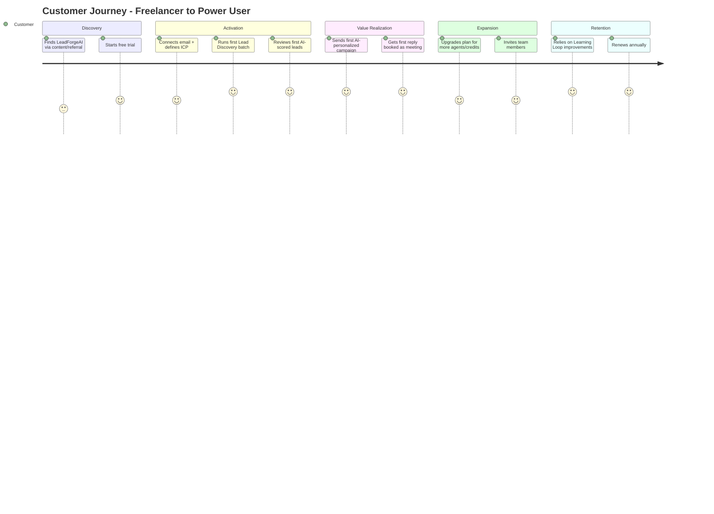

## 1.6 Value Proposition

> "LeadForgeAI turns a target market into a booked-meeting pipeline without a human ever writing a cold email from scratch — because every message is generated from real analysis of a real company, not a template."

Core pillars:

1. **Analysis before outreach.** Every message is downstream of an actual website/SEO/tech-stack analysis, not a generic pitch.
2. **Multi-agent specialization.** Discovery, analysis, scoring, writing, and follow-up are handled by agents purpose-built for that step, coordinated by a Supervisor Agent, rather than one monolithic prompt.
3. **Closed feedback loop.** Reply/positive-outcome data feeds back into scoring and prompt strategy, so quality compounds instead of plateauing.
4. **Anti-spam by design.** Rate limits, personalization minimums, and compliance tooling are architectural constraints, not opt-in settings — protecting sender reputation and, by extension, all tenants' deliverability.

## 1.7 Competitive Advantages

| Advantage | Why it's defensible |
|---|---|
| Agent specialization | Harder to replicate than a single-prompt "AI SDR" — requires orchestration engineering, not just prompt engineering |
| Outcome-linked learning loop | Proprietary reply/booking data becomes a scoring/prompting asset competitors without traffic can't replicate |
| Vertical focus (software services) | Deep templates for the services actually being sold (chatbots, CRM builds, automation) beat horizontal "any industry" tools |
| Deliverability-first architecture | Rate limiting, warmup, and compliance baked into the sending pipeline protect long-term email reputation, a scarce resource |

## 1.8 Future Vision

Beyond Phase 3 (see §19), LeadForgeAI aims to become the default operating layer through which small software businesses run *all* revenue-generating activity — discovery, outreach, proposals, contracts, and eventually delivery handoff into project management — with a public API and marketplace turning it into a platform, not just a tool.


---

# 2. Product Requirements Document (PRD)

## 2.1 Functional Requirements

### FR-1 Lead Discovery
- FR-1.1 System shall discover candidate companies matching a user-defined Ideal Customer Profile (ICP: industry, geography, size, tech signals).
- FR-1.2 System shall deduplicate discovered companies against existing tenant records and a global (privacy-safe) seen-domains index.
- FR-1.3 System shall support manual CSV import of leads alongside automated discovery.

### FR-2 Website & Business Analysis
- FR-2.1 System shall crawl and analyze a company's public website (tech stack, design quality, missing features, page speed, SEO signals).
- FR-2.2 System shall infer plausible business problems (e.g., "no online booking," "no chatbot," "slow mobile load") from analysis output.

### FR-3 Opportunity Scoring
- FR-3.1 System shall assign a 0–100 opportunity score per lead based on weighted signals (problem severity, company size fit, buying-power signals, engagement history).
- FR-3.2 Score explanations shall be human-readable, not opaque numbers.

### FR-4 Outreach Generation & Sending
- FR-4.1 System shall generate personalized first-touch emails referencing specific analysis findings.
- FR-4.2 System shall generate multi-step follow-up sequences with configurable delays.
- FR-4.3 System shall send via user-connected mailbox (OAuth) respecting per-domain rate limits.
- FR-4.4 System shall track opens, replies, and bounces.

### FR-5 Pipeline / CRM
- FR-5.1 System shall represent leads as deals moving through a configurable pipeline (stages).
- FR-5.2 System shall log all activities (emails, calls, notes, meetings) on a per-lead timeline.

### FR-6 Proposals, Quotations, Contracts
- FR-6.1 System shall generate a draft proposal and quotation from a deal's context (services selected, scope notes).
- FR-6.2 System shall generate a draft contract from an approved proposal using stored templates.

### FR-7 Meetings
- FR-7.1 System shall offer scheduling links / calendar integration and log booked meetings against the deal.

### FR-8 Reporting & Learning
- FR-8.1 System shall produce campaign and pipeline performance reports.
- FR-8.2 System shall feed outcome data (opened/replied/booked/won) back into scoring and prompt-selection logic.

### FR-9 Multi-tenancy & Access Control
- FR-9.1 System shall isolate all tenant data at the row level (organization_id) and support role-based permissions (Owner, Admin, Member, Read-only).

## 2.2 Non-Functional Requirements

| Category | Requirement |
|---|---|
| Scalability | Support 10,000+ tenants and 10M+ lead records without architectural rework; horizontal scaling of API and worker tiers |
| Availability | 99.9% uptime target for core API; graceful degradation of AI features if a provider is down |
| Latency | P95 API response < 400ms for CRUD endpoints; async jobs for anything AI/browser-automation related |
| Security | SOC 2-aligned controls from day one (see §15); encryption in transit and at rest |
| Data residency | Tenant data stored in a single region initially (US), architecture must allow region sharding later |
| Auditability | All mutating actions logged to an immutable audit trail |
| Deliverability | Sending architecture must protect domain reputation — no tenant's misuse should affect another's deliverability |
| Extensibility | New AI agents and new outreach channels (LinkedIn, WhatsApp) addable without core schema rewrites |

## 2.3 Representative User Stories & Acceptance Criteria

**US-1:** *As an agency owner, I want to define my ICP once and get a stream of new scored leads automatically, so I don't have to manually prospect.*
- AC: Given an ICP is saved, when the daily discovery job runs, then new candidate companies matching the ICP appear in the Lead Explorer with a score and analysis summary within 24 hours.

**US-2:** *As a freelancer, I want each cold email to reference something true about the prospect's site, so my reply rate is higher than generic templates.*
- AC: Given a lead has completed website analysis, when outreach is generated, then the email body contains at least one specific, verifiable reference to analysis findings (e.g., a named missing feature).

**US-3:** *As a sales rep, I want follow-ups to stop automatically once a prospect replies, so we never look like a bot.*
- AC: Given a reply is detected on a thread, when the next scheduled follow-up would fire, then it is automatically cancelled and the deal is flagged "Needs human reply."

**US-4:** *As an agency admin, I want role-based access so junior reps can't delete pipeline data.*
- AC: Given a user has role "Member," when they attempt to delete a deal, then the action is rejected with a 403 and logged.

## 2.4 Business Rules

- No outbound email may be sent to a contact who has unsubscribed or hard-bounced previously (enforced at the send-service layer, not just the campaign layer).
- A lead may not receive more than N (configurable, default 4) outbound touches in a single sequence without a reply.
- Minimum personalization threshold: an email failing an automated "genericness" check is blocked from sending and flagged for human review.
- Opportunity scores must recompute whenever new analysis, engagement, or firmographic data arrives — scores are never static after creation.

## 2.5 Assumptions

- Tenants will connect their own sending mailbox (Gmail/Outlook OAuth) rather than LeadForgeAI sending on their behalf from a shared domain, to protect deliverability and simplify compliance ownership.
- Public company websites are the primary analysis surface; no assumption of access to private/internal systems.
- Initial launch targets English-language markets (US/UK/EU/India English-speaking segments).

## 2.6 Constraints

- Must comply with CAN-SPAM, CASL, and GDPR/UK-GDPR outreach rules from day one given the international target market.
- Browser automation must respect robots.txt and site terms where legally required, and must degrade to metadata-only analysis when a site blocks automated access.
- Initial infra budget assumes a small VPS-based deployment (Hostinger KVM), not a hyperscaler, which shapes early infrastructure choices (see §5).

## 2.7 Risks

| Risk | Mitigation |
|---|---|
| Email deliverability collapse due to aggressive sending | Rate limiting, warm-up guidance, per-tenant sending health scoring, hard caps |
| AI-generated outreach perceived as spam / low-quality | Genericness/quality classifier gate before send; human-in-the-loop approval mode by default for new tenants |
| LLM provider outage or price change | Provider abstraction layer (see §4.9), fallback model configuration |
| Legal exposure from scraping | Respect robots.txt, avoid personal-data scraping beyond public business contact info, maintain a documented lawful-basis policy |
| Data breach of contact/PII data | Encryption at rest, least-privilege access, audit logging, routine pen testing |

## 2.8 Success Metrics & KPIs

| Metric | Target (Year 1) |
|---|---|
| Trial → paid conversion | ≥ 12% |
| Reply rate on AI-generated first touch | ≥ 8% (vs. ~1–3% industry generic baseline) |
| Meetings booked per active tenant / month | ≥ 3 |
| Monthly logo churn | < 4% |
| P95 lead-discovery-to-scored-in-dashboard latency | < 24h |
| Sending-domain reputation incidents | 0 tenant-caused blocklisting events per quarter |


---

# 3. Complete System Architecture

## 3.1 High-Level Architecture

LeadForgeAI is a **modular microservices platform** fronted by a single API Gateway, backed by an event bus for asynchronous agent work, with a PostgreSQL system-of-record and a vector database for semantic memory/search.

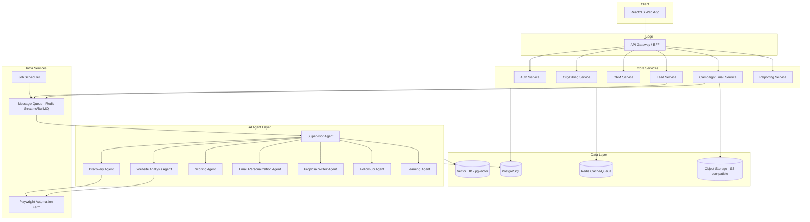

## 3.2 Microservices Decomposition

| Service | Responsibility | Data Owned |
|---|---|---|
| Auth Service | Login, JWT issuance, SSO, session/token management | users, sessions, tokens |
| Org/Billing Service | Tenants, roles, permissions, subscriptions, invoices, Stripe sync | organizations, roles, permissions, subscriptions, invoices, payments |
| Lead Service | Lead/company/contact CRUD, discovery job orchestration | leads, companies, contacts |
| Analysis Service | Triggers website/SEO analysis, stores structured findings | website_analysis, seo_reports |
| Scoring Service | Computes and recomputes opportunity scores | scoring inputs/outputs (embedded in leads) |
| Campaign/Email Service | Templates, campaigns, sending, tracking | email_templates, outreach_campaigns, emails |
| CRM Service | Pipelines, deals, activities, notes, tasks | pipelines, deals, activities, notes, tasks |
| Proposal Service | Proposal/quotation/contract generation | proposals, quotations, contracts (in Deals schema) |
| Meeting Service | Scheduling links, calendar sync | meetings |
| Reporting Service | Aggregations, dashboards, exports | analytics, materialized views |
| Agent Orchestration Service | Hosts Supervisor + specialized agents, agent memory/logs | agent_memory, agent_logs, ai_conversations |
| Notification Service | In-app + email system notifications | notifications |
| Integration Service | Third-party OAuth connections (mailbox, calendar, CRM imports) | integrations, api_keys |
| Audit Service | Immutable audit log ingestion | audit_logs |

Each service owns its tables; cross-service reads happen via internal APIs or read replicas — never direct cross-schema joins from another service's code, to preserve independent deployability.

## 3.3 Component Diagram (Runtime)

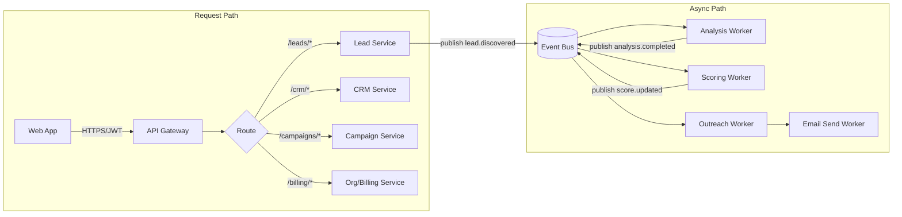

## 3.4 Sequence Diagram — Lead Discovery to First Outreach

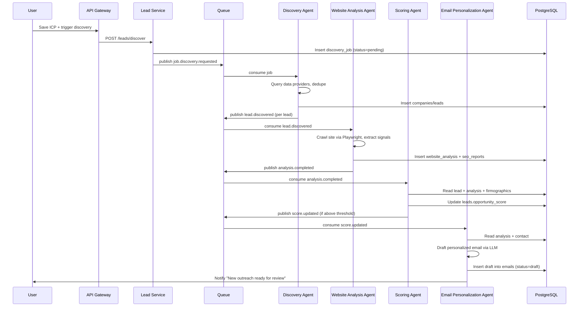

## 3.5 Deployment Architecture

Initial deployment target is a **single-region Hostinger KVM VPS cluster** (see §5.4), containerized with Docker Compose, structured so it can be lifted into Kubernetes without a rewrite (services are already stateless + 12-factor).

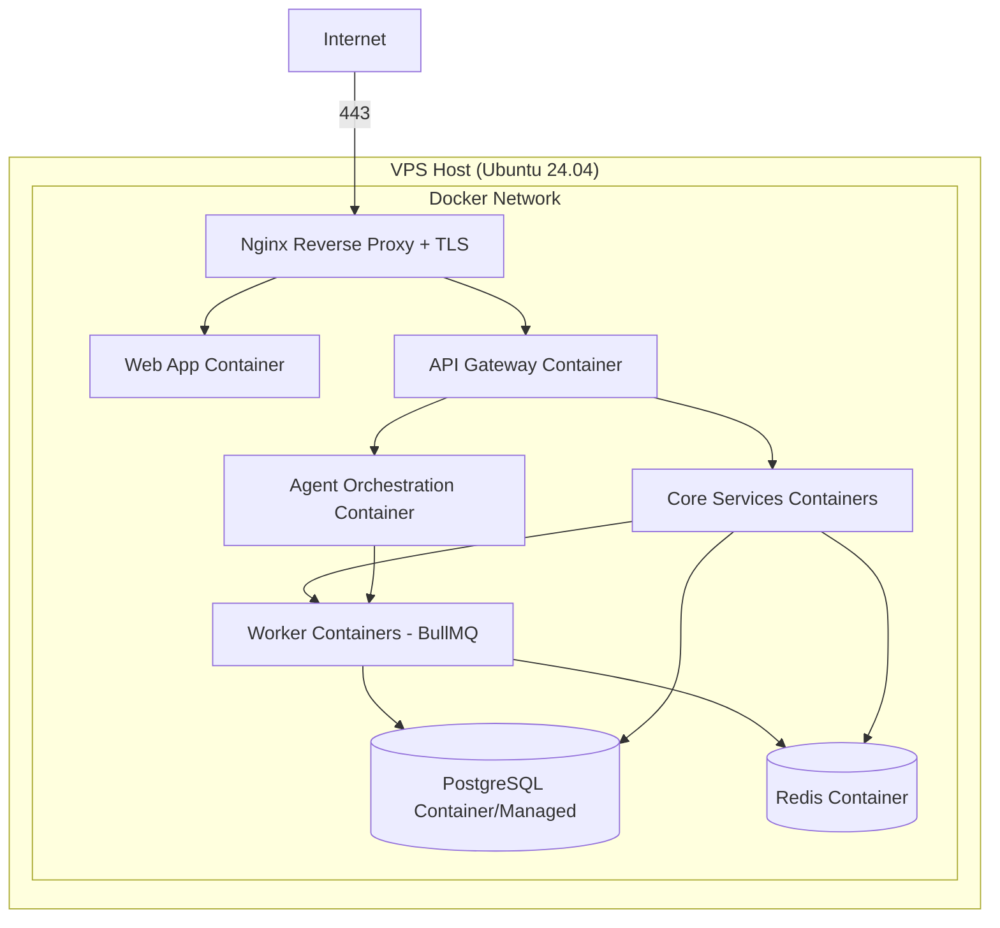

As tenant volume grows, the migration path is: split worker containers onto a dedicated compute VPS → move PostgreSQL to a managed instance (e.g., Neon/RDS-compatible) → introduce Kubernetes when service count and scaling needs justify the operational overhead (see §5.3 for readiness notes).

## 3.6 Infrastructure Architecture

- **Compute:** Docker Compose on VPS initially; Kubernetes-ready manifests maintained in parallel from month 1 so migration is a deployment-target change, not a redesign.
- **Data:** PostgreSQL as system of record; Redis for cache + queue; pgvector extension on Postgres for embeddings (avoids a separate vector DB operational burden until scale demands it).
- **Storage:** S3-compatible object storage (e.g., Cloudflare R2 or Backblaze B2) for attachments, generated PDFs, screenshots.
- **CDN:** Cloudflare in front of the web app and static assets for caching + DDoS protection.

## 3.7 AI Architecture

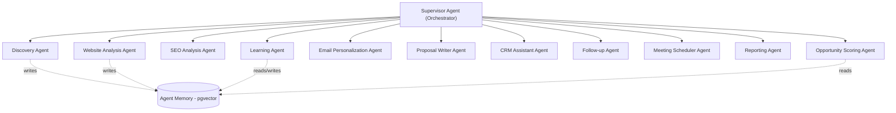

The Supervisor Agent pattern (rather than a single mega-prompt) is chosen because: (1) each specialized agent has a narrower, more testable prompt and tool surface; (2) failures are isolated — a scoring bug doesn't corrupt email generation; (3) different agents can use different models sized to task complexity (cheap/fast model for discovery filtering, stronger model for proposal writing), controlling cost at scale. Full agent specs are in §8.

## 3.8 Service Communication

- **Synchronous:** REST over HTTPS between Web App ↔ Gateway ↔ Services, using JSON with versioned contracts (`/v1/...`). Internal service-to-service synchronous calls use the same REST convention over the private Docker network.
- **Asynchronous:** Event-driven via Redis Streams (BullMQ) initially; abstracted behind a thin publisher/consumer interface so swapping to Kafka/NATS later (at higher throughput) doesn't touch business logic.

## 3.9 API Gateway

The Gateway is a lightweight Node/Express (or Fastify) BFF responsible for: JWT verification, request routing, rate limiting, request/response logging, and API versioning. It does not contain business logic — that stays in domain services — keeping the gateway easy to reason about and scale independently.

## 3.10 Event-Driven Architecture

Core domain events (non-exhaustive):

| Event | Producer | Consumers |
|---|---|---|
| `lead.discovered` | Lead Service | Analysis Worker |
| `analysis.completed` | Analysis Worker | Scoring Worker, Reporting |
| `score.updated` | Scoring Worker | Outreach Worker, Reporting |
| `email.sent` | Campaign Service | Reporting, Follow-up Agent |
| `email.replied` | Inbox Poller | Follow-up Agent (cancels sequence), CRM Service |
| `meeting.booked` | Meeting Service | CRM Service, Reporting |
| `deal.won` / `deal.lost` | CRM Service | Learning Agent, Reporting |

Events are persisted (outbox pattern from the producing service's transaction) before publishing, guaranteeing at-least-once delivery; consumers are idempotent (dedup by event id).

## 3.11 Queue Architecture

BullMQ (Redis-backed) queues are separated by workload class so a burst in one doesn't starve another:

- `queue:discovery` — external API calls, rate-limited
- `queue:browser-automation` — Playwright jobs, concurrency-capped per host
- `queue:scoring` — CPU-light, high concurrency
- `queue:ai-generation` — LLM calls, concurrency capped by provider rate limit and cost budget
- `queue:email-send` — strict per-tenant and per-domain rate limiting
- `queue:reporting` — low-priority batch aggregation

## 3.12 Caching Strategy

- **Redis** caches: session/JWT-blacklist lookups, org/plan/feature-flag lookups, hot dashboard aggregates (short TTL, 60–300s), rate-limit counters.
- **Cache invalidation:** write-through on mutation of org/plan; TTL-based expiry for aggregates (acceptable staleness for dashboards).
- **HTTP caching:** CDN caches static assets and public marketing pages; API responses are not cached at CDN layer (tenant-specific).

## 3.13 Scalability Strategy

- Stateless API/service containers scale horizontally behind Nginx/load balancer.
- Worker concurrency scales independently per queue based on backlog depth (autoscaling rule: queue depth > N for 5 minutes → add worker replica).
- Database scaling path: vertical scaling first (VPS/managed Postgres tier bump) → read replicas for reporting queries → partitioning of high-volume tables (`emails`, `activities`, `agent_logs`) by `organization_id` range or by month once row counts justify it.
- Multi-tenancy uses shared-schema-with-row-level-security initially (simplest operationally); a "pooled → siloed" migration path exists for enterprise tenants requiring dedicated infrastructure later.

## 3.14 High Availability

- All stateless services run ≥2 replicas behind the reverse proxy once traffic justifies it (single-replica acceptable pre-revenue, documented as a known limitation, not a design flaw).
- PostgreSQL runs with streaming replication (standby) once on managed infrastructure; automated failover via the managed provider.
- Redis runs in a persistence-enabled mode (AOF) so queued jobs survive restarts; a Redis outage degrades async processing (jobs queue up) rather than causing data loss.

## 3.15 Disaster Recovery

| Component | RPO | RTO | Strategy |
|---|---|---|---|
| PostgreSQL | 5 min | 1 hr | Continuous WAL archiving + daily full backup, tested restore quarterly |
| Object Storage | ~0 (provider-replicated) | N/A | S3-compatible provider handles durability |
| Redis (queue state) | Best-effort | 15 min | AOF persistence; queue jobs are re-derivable from Postgres event outbox if lost |
| Full environment | — | 4 hr | Infrastructure-as-code (Docker Compose + Terraform for DNS/CDN) allows rebuild on a fresh VPS from backups + IaC |


---

# 4. Technology Stack

Every choice below is justified against at least one credible alternative. The guiding principle: **boring, well-supported technology for the system-of-record; best-in-class AI tooling for the agent layer.**

## 4.1 Frontend

| Choice | React 18 + TypeScript + Vite |
|---|---|
| Why | Largest ecosystem/hiring pool; TypeScript catches contract errors against the typed API layer; Vite gives fast dev-server iteration vs. CRA/Webpack |
| Alternative considered | Next.js (App Router) — rejected for v1 because we don't need SSR/SEO for an authenticated app-shell product; adds deployment complexity we don't need yet. Revisit if a public marketing/blog surface needs SSR — likely as a *separate* Next.js marketing site, not the app itself |
| State/data | TanStack Query (server cache) + Zustand (light client state) — avoids Redux boilerplate while keeping state predictable |
| UI Kit | Tailwind CSS + shadcn/ui — utility CSS for velocity, headless components for accessibility without fighting a heavy design system |
| Charts | Recharts — sufficient for dashboard needs, React-native API, avoids D3's learning curve for standard chart types |

## 4.2 Backend

| Choice | Node.js (NestJS) for core CRUD/API services; Python (FastAPI) for AI/agent orchestration services |
|---|---|
| Why split | NestJS gives strong structure (modules/DI) ideal for CRM/billing/org services maintained by a general backend team. Python is the native ecosystem for LLM orchestration (LangChain/LlamaIndex-adjacent tooling, embeddings, Playwright's most mature bindings), so the agent layer is Python-first |
| Alternative considered | All-Python (Django) — rejected because Node's async I/O and TypeScript-shared types with the frontend reduce contract drift on the high-traffic CRUD surface. All-Node with an LLM SDK only — rejected because Python's AI/data ecosystem (numpy/pandas for scoring features, Playwright-Python, LLM framework maturity) is materially better for the agent layer |
| Inter-language contract | OpenAPI spec generated from NestJS services; Python services conform to the same spec so the boundary is explicit and typed on both sides |

## 4.3 Database

| Choice | PostgreSQL 16 |
|---|---|
| Why | Relational integrity for billing/CRM data is non-negotiable; native `pgvector` extension lets us avoid a separate vector database at current scale; mature row-level security supports multi-tenant isolation cleanly; JSONB columns give schema flexibility for agent outputs without abandoning relational guarantees elsewhere |
| Alternative considered | MongoDB — rejected: CRM/billing data is inherently relational (deals→contacts→companies→orgs), and we'd still need a relational store alongside it, doubling operational surface for no real gain |

## 4.4 Authentication

| Choice | Auth via first-party service using JWT (access + refresh tokens) + OAuth2 for Google/Microsoft (mailbox connect) |
|---|---|
| Why | Full control over multi-tenant/session semantics; OAuth needed anyway for mailbox/calendar integration, so we build one OAuth-handling module and reuse it |
| Alternative considered | Third-party auth (Clerk/Auth0) — reasonable choice, flagged as an accelerant option for MVP if engineering bandwidth is the binding constraint; documented as a swap-in behind the Auth Service interface either way |

## 4.5 Message Queue

| Choice | Redis Streams via BullMQ |
|---|---|
| Why | We already run Redis for caching; BullMQ gives job retries, delays (needed for follow-up scheduling), rate limiting, and concurrency control out of the box, with a mature Node client. Avoids running a separate broker (RabbitMQ/Kafka) before volume justifies it |
| Alternative considered | Kafka — over-engineered for current throughput; revisit only if event volume/replay requirements exceed Redis Streams' comfortable range (documented migration trigger: >10M events/day sustained) |

## 4.6 Caching

Redis (same instance/cluster as the queue, logically separated by key namespace/DB index) — avoids a second caching technology for marginal benefit at this scale.

## 4.7 Object Storage

Cloudflare R2 (S3-compatible, no egress fees) for attachments, generated proposal/contract PDFs, and website screenshots. Alternative considered: AWS S3 — rejected for cost given expected read-heavy egress (proposal downloads, screenshot serving) at this stage; R2's S3 API compatibility keeps a future migration cheap if needed.

## 4.8 AI Providers / LLMs

| Choice | Anthropic Claude models via API, provider-abstracted |
|---|---|
| Why | Strong instruction-following and long-context performance suit multi-step agent reasoning and document generation (proposals/contracts); tool-use support fits the agent architecture directly |
| Model tiering | Cheaper/faster model for high-volume, low-complexity tasks (discovery filtering, classification); stronger model for high-stakes generation (outreach copy, proposals, contracts) — tiering controls unit economics at scale |
| Provider abstraction | All agent code calls an internal `LLMClient` interface, not a vendor SDK directly, so a provider or model swap is a config change, not a rewrite. This also enables fallback routing if a provider has an outage |

## 4.9 Embeddings & Vector Database

| Choice | Text embeddings stored in PostgreSQL via `pgvector` |
|---|---|
| Why | Agent memory (past successful email patterns, company research notes) and semantic lead search benefit from vector similarity, but volume doesn't yet justify a dedicated vector DB (Pinecone/Weaviate) with its own ops burden. `pgvector` keeps everything in one transactional store |
| Migration trigger | If embedding row counts or query latency exceed comfortable `pgvector` HNSW index performance (rough guide: tens of millions of vectors with tight latency SLAs), migrate to a dedicated vector DB behind the same internal `VectorStore` interface |

## 4.10 Monitoring, Logging, Analytics

| Concern | Choice | Why |
|---|---|---|
| APM/Error tracking | Sentry | Best-in-class error grouping across Node + Python + React in one product |
| Metrics | Prometheus + Grafana | Self-hostable on the VPS, standard for container metrics, no per-seat SaaS cost pressure early on |
| Log aggregation | Loki (paired with Grafana) or hosted (e.g., Better Stack) once volume grows | Keeps logs queryable without standing up an ELK stack prematurely |
| Product analytics | PostHog (self-hostable) | Combines product analytics + session replay + feature flags in one tool, avoiding stitching 3 SaaS tools together |

## 4.11 Email Service

- **Sending:** Tenant's own mailbox via OAuth (Gmail API / Microsoft Graph) for authenticity and deliverability ownership; **Postmark** as a fallback/transactional layer for system emails (invoices, notifications, password resets) where a shared, reputation-managed sending domain is appropriate.
- **Why not a bulk ESP (SendGrid/Mailgun) for outreach itself:** Cold outreach from a shared bulk-sending IP range is exactly what damages deliverability and looks like spam; sending "as the actual person" via their own mailbox is both more compliant and more effective.

## 4.12 Browser Automation

**Playwright** (Python) — chosen over Puppeteer/Selenium for first-class multi-browser support, robust auto-waiting semantics (fewer flaky scrapes), and strong Python bindings that integrate with the Python-based agent layer. Run in a containerized, isolated "browser farm" pool (see §14) with per-domain concurrency and rate limits.

## 4.13 Scheduler

**BullMQ delayed/repeatable jobs** for follow-up sequencing and daily discovery runs; **node-cron**-equivalent (BullMQ repeatable jobs) rather than system crontab, so scheduled jobs are observable/manageable through the same queue dashboard as everything else.

## 4.14 DevOps / Infrastructure / Containerization

| Concern | Choice |
|---|---|
| Containerization | Docker, one image per service, multi-stage builds for small runtime images |
| Local orchestration | Docker Compose |
| Production orchestration (initial) | Docker Compose on a Hostinger KVM VPS (see §5.4) |
| Production orchestration (scale-out) | Kubernetes (k3s first, for lighter footprint, then full k8s if needed) — manifests maintained in parallel from day one |
| Reverse proxy / TLS | Nginx + Certbot (Let's Encrypt) |
| CI/CD | GitHub Actions |
| IaC | Terraform for DNS/CDN/object storage; Ansible or plain shell scripts for VPS provisioning until Kubernetes migration justifies full IaC of compute |

## 4.15 Testing

| Layer | Tooling |
|---|---|
| Unit (Node) | Jest |
| Unit (Python) | Pytest |
| API/integration | Supertest (Node) / Pytest + httpx (Python) against a Dockerized test Postgres |
| UI | React Testing Library + Playwright for E2E |
| Load | k6 |
| AI evaluation | Custom eval harness (see §18.7) using labeled prompt/response fixtures + LLM-graded rubrics |


---

# 5. Development Environment

## 5.1 Local Development

Developers run the full stack via Docker Compose (`docker-compose.dev.yml`), which brings up: Postgres, Redis, the NestJS core services (hot-reload via `ts-node-dev`), the Python agent services (hot-reload via `uvicorn --reload`), and the React app (Vite dev server). A single `make dev` (or `pnpm dev`) target wraps this so onboarding is one command.

## 5.2 Production Environment

Production runs the same container images built in CI (no "works in dev, breaks in prod" drift), deployed via `docker-compose.prod.yml` with environment-specific overrides (replica counts, resource limits, production env vars pulled from the secrets manager).

## 5.3 Docker, Docker Compose, Kubernetes Readiness

- Every service Dockerfile is written 12-factor style (config via env vars, no baked-in secrets, logs to stdout/stderr) so it runs identically under Compose or a Kubernetes Pod.
- Kubernetes manifests (Deployment/Service/Ingress/HPA) are maintained under `/infra/k8s` from month one as a parallel, CI-validated (via `kubeval`/`kubeconform`) artifact — not written, but not implemented in prod — so the eventual migration is a cutover, not a rewrite.

## 5.4 Ubuntu Server & Hostinger KVM VPS Deployment

- **OS:** Ubuntu Server 24.04 LTS.
- **Initial sizing guidance:** a KVM VPS with ≥4 vCPU / 8–16GB RAM / NVMe storage comfortably runs Postgres + Redis + all service containers for the first several hundred tenants; scale vertically (bigger VPS tier) before scaling out, per §3.13.
- **Hardening baseline:** UFW firewall (only 22/80/443 open, SSH key-only auth), fail2ban, unattended-security-upgrades, Docker daemon not exposed publicly, Postgres/Redis bound to the internal Docker network only.

## 5.5 VS Code, Python Environment, Node.js Environment

- **Editor:** VS Code with a shared `.vscode/extensions.json` recommending ESLint, Prettier, Python, Docker, and Tailwind CSS IntelliSense extensions, plus a repo `.editorconfig` for consistent formatting across contributors.
- **Node:** managed via `nvm`/`.nvmrc` pinned to the LTS version used in CI; package manager: `pnpm` (faster installs, strict dependency resolution reduces "phantom dependency" bugs vs npm).
- **Python:** managed via `pyenv` + `poetry` for reproducible lockfile-based dependency management across the agent services.

## 5.6 Environment Variables & Secrets Management

- Local: `.env` files (git-ignored), with a committed `.env.example` documenting every required variable.
- Production: secrets injected via a secrets manager (Doppler or, budget-permitting, a self-hosted Vault) rather than plain `.env` files on the VPS; CI/CD pulls secrets at deploy time and injects them into the container runtime, never committing them to images or the repo.

## 5.7 Configuration Strategy

Layered configuration: hardcoded defaults → `.env`/secrets manager values → per-organization feature-flag overrides (stored in Postgres, cached in Redis) for things like AI model tier, discovery cadence, or sending limits that vary by plan/tenant.

## 5.8 Developer Setup Guide (Summary)

1. Clone repo, run `pnpm install` at the root (workspaces cover both the web app and shared TS packages).
2. Copy `.env.example` → `.env`, fill in local secrets (test API keys).
3. `docker compose -f docker-compose.dev.yml up -d` to start Postgres/Redis.
4. `pnpm db:migrate && pnpm db:seed` to set up and seed the local schema.
5. `pnpm dev` starts all services concurrently (via `turbo`/`nx` task runner) with hot reload.
6. Visit `http://localhost:5173` for the web app; API Gateway at `http://localhost:4000`.


---

# 6. Complete Folder Structure

The repository is a **monorepo** (managed with `pnpm` workspaces + `turbo`) so shared TypeScript types (e.g., API DTOs) are consumed by both frontend and Node backend without publishing internal npm packages.

```
leadforgeai/
├── apps/
│   ├── web/                        # React + TS frontend (Vite)
│   │   ├── src/
│   │   │   ├── pages/               # One folder per route (see §10)
│   │   │   ├── components/          # Shared/reusable UI components
│   │   │   ├── features/            # Feature-scoped components+hooks (crm/, campaigns/, leads/...)
│   │   │   ├── hooks/                # Cross-feature hooks
│   │   │   ├── lib/                  # API client, query client, utils
│   │   │   ├── store/                 # Zustand stores
│   │   │   ├── styles/               # Tailwind config, globals
│   │   │   └── main.tsx
│   │   ├── public/
│   │   └── vite.config.ts
│   │
│   ├── gateway/                     # API Gateway (NestJS BFF)
│   │   └── src/
│   │       ├── modules/routing, auth-guard, rate-limit
│   │       └── main.ts
│   │
│   ├── auth-service/                # NestJS
│   ├── org-billing-service/         # NestJS
│   ├── crm-service/                 # NestJS
│   ├── lead-service/                # NestJS
│   ├── campaign-service/            # NestJS
│   ├── reporting-service/           # NestJS
│   ├── notification-service/        # NestJS
│   ├── integration-service/         # NestJS
│   ├── audit-service/               # NestJS
│   │
│   └── agent-orchestration/         # Python (FastAPI) — the AI layer
│       ├── app/
│       │   ├── agents/
│       │   │   ├── supervisor.py
│       │   │   ├── discovery_agent.py
│       │   │   ├── website_analysis_agent.py
│       │   │   ├── seo_analysis_agent.py
│       │   │   ├── scoring_agent.py
│       │   │   ├── email_personalization_agent.py
│       │   │   ├── proposal_writer_agent.py
│       │   │   ├── crm_assistant_agent.py
│       │   │   ├── followup_agent.py
│       │   │   ├── meeting_scheduler_agent.py
│       │   │   ├── reporting_agent.py
│       │   │   └── learning_agent.py
│       │   ├── tools/                # Shared tool implementations (web_fetch, crawler, scorer, etc.)
│       │   ├── memory/               # pgvector-backed agent memory access layer
│       │   ├── llm/                  # LLMClient abstraction + provider adapters
│       │   ├── prompts/              # Versioned prompt templates per agent
│       │   ├── workers/              # Queue consumers wiring events → agents
│       │   └── main.py
│       └── tests/
│
├── packages/                        # Shared code across apps
│   ├── shared-types/                 # TS types/DTOs shared by web + gateway + Node services
│   ├── ui/                            # Shared design-system components (shadcn-based)
│   ├── config/                        # Shared eslint/tsconfig/tailwind config
│   └── event-contracts/               # Event name + payload schemas (shared Node/Python via JSON Schema)
│
├── infra/
│   ├── docker/
│   │   ├── docker-compose.dev.yml
│   │   ├── docker-compose.prod.yml
│   │   └── Dockerfile.* (per service)
│   ├── k8s/                          # Kubernetes-readiness manifests (see §5.3)
│   ├── nginx/                         # Reverse proxy configs, TLS
│   └── terraform/                     # DNS, CDN, object storage
│
├── db/
│   ├── migrations/                    # SQL migrations (per service schema, see §7)
│   └── seeds/
│
├── scripts/                          # One-off ops/dev scripts
├── .github/workflows/                 # CI/CD pipelines
├── docs/                              # This SDD + ADRs (architecture decision records)
├── .env.example
├── turbo.json
├── pnpm-workspace.yaml
└── README.md
```

**Rationale for monorepo:** shared types between the Gateway/services and the React app prevent contract drift (a changed DTO breaks the build at compile time, not in production). Python services remain a separate workspace root (Poetry-managed) but share event contracts with the Node side via generated JSON Schema, keeping the two ecosystems loosely coupled at the wire level while tightly coupled at the "what does this event mean" level.


---

# 7. Database Architecture

## 7.1 Design Principles

- **Multi-tenancy:** every tenant-scoped table carries `organization_id UUID NOT NULL REFERENCES organizations(id)`, with PostgreSQL Row-Level Security policies enforcing `organization_id = current_setting('app.current_org')::uuid` on every query. This is the single most important invariant in the schema.
- **UUIDv7** (time-ordered UUIDs) used for all primary keys — globally unique (safe for future sharding) while remaining index-friendly (unlike random UUIDv4).
- **Soft deletes** (`deleted_at TIMESTAMPTZ`) on user-facing entities so accidental deletes are recoverable; hard deletes reserved for GDPR erasure requests via a dedicated purge job.
- **Audit columns** (`created_at`, `updated_at`, `created_by`, `updated_by`) on every table.
- **3NF baseline** with deliberate denormalization only where read-performance clearly justifies it (e.g., `leads.opportunity_score` is a materialized column recomputed by the Scoring Agent rather than computed on every read).

## 7.2 Entity Relationship Overview

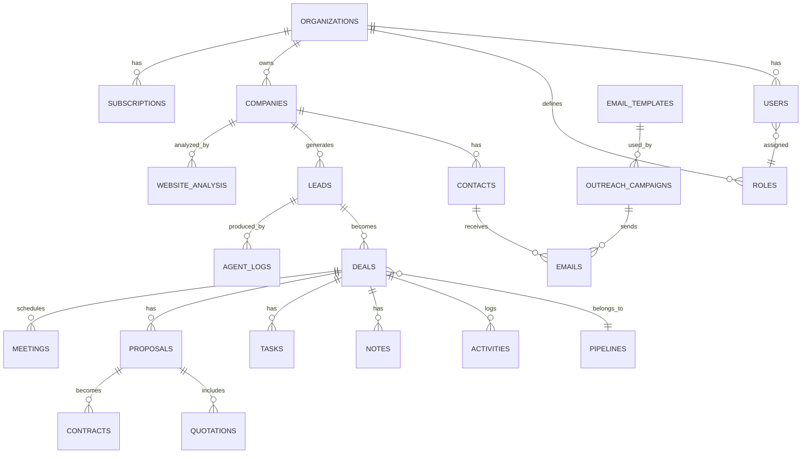

## 7.3 Core Tables

### 7.3.1 `organizations`

| Field | Type | Notes |
|---|---|---|
| id | UUID PK | |
| name | TEXT NOT NULL | |
| slug | TEXT UNIQUE NOT NULL | Used in URLs/subdomains |
| plan_id | UUID FK → plans.id | |
| billing_email | TEXT | |
| status | TEXT CHECK IN ('trialing','active','past_due','canceled') | |
| trial_ends_at | TIMESTAMPTZ | |
| created_at / updated_at | TIMESTAMPTZ | |

### 7.3.2 `users`

| Field | Type | Notes |
|---|---|---|
| id | UUID PK | |
| organization_id | UUID FK | RLS key |
| email | TEXT UNIQUE NOT NULL | |
| password_hash | TEXT NULL | Null if SSO-only |
| full_name | TEXT | |
| role_id | UUID FK → roles.id | |
| status | TEXT CHECK IN ('active','invited','disabled') | |
| last_login_at | TIMESTAMPTZ | |
| created_at / updated_at / deleted_at | TIMESTAMPTZ | |

Index: `(organization_id, email)` unique composite (in addition to global email uniqueness if single-workspace-per-email is enforced).

### 7.3.3 `roles` / `permissions`

`roles(id, organization_id NULLABLE for system-default roles, name, description)`
`permissions(id, code UNIQUE, description)` — e.g., `deals.delete`, `campaigns.send`
`role_permissions(role_id FK, permission_id FK, PRIMARY KEY(role_id, permission_id))` — classic many-to-many join table.

### 7.3.4 `companies`

| Field | Type | Notes |
|---|---|---|
| id | UUID PK | |
| organization_id | UUID FK | RLS key |
| name | TEXT NOT NULL | |
| domain | TEXT | Unique per organization (composite index) |
| industry | TEXT | |
| employee_count_range | TEXT | e.g., '11-50' |
| location_country / location_city | TEXT | |
| tech_stack | JSONB | Detected technologies |
| source | TEXT CHECK IN ('ai_discovery','manual_import','referral') | |
| created_at / updated_at | TIMESTAMPTZ | |

Index: `(organization_id, domain)` UNIQUE — prevents duplicate discovery of the same company per tenant.

### 7.3.5 `contacts`

| Field | Type | Notes |
|---|---|---|
| id | UUID PK | |
| organization_id | UUID FK | |
| company_id | UUID FK → companies.id | |
| full_name | TEXT | |
| email | TEXT | |
| title | TEXT | |
| linkedin_url | TEXT | |
| email_status | TEXT CHECK IN ('valid','unsubscribed','bounced','unknown') | Enforced at send-time (Business Rule §2.4) |
| created_at / updated_at | TIMESTAMPTZ | |

Index: `(organization_id, email)`.

### 7.3.6 `leads`

| Field | Type | Notes |
|---|---|---|
| id | UUID PK | |
| organization_id | UUID FK | |
| company_id | UUID FK → companies.id | |
| primary_contact_id | UUID FK → contacts.id NULLABLE | |
| opportunity_score | SMALLINT CHECK (0-100) | Recomputed by Scoring Agent |
| score_explanation | JSONB | Human-readable factor breakdown |
| status | TEXT CHECK IN ('new','analyzing','scored','qualified','disqualified','converted') | |
| services_of_interest | TEXT[] | e.g., {'website_redesign','ai_chatbot'} |
| created_at / updated_at | TIMESTAMPTZ | |

Index: `(organization_id, status, opportunity_score DESC)` — powers the Lead Explorer's default sort.

### 7.3.7 `website_analysis`

| Field | Type | Notes |
|---|---|---|
| id | UUID PK | |
| organization_id | UUID FK | |
| company_id | UUID FK | |
| crawled_at | TIMESTAMPTZ | |
| tech_stack | JSONB | |
| performance_score | SMALLINT | Lighthouse-style 0-100 |
| accessibility_score | SMALLINT | |
| identified_problems | JSONB | Array of {problem, severity, evidence} |
| screenshot_url | TEXT | Object storage reference |
| raw_html_ref | TEXT | Object storage reference (not stored inline) |

### 7.3.8 `seo_reports`

`id, organization_id, company_id, checked_at, meta_issues JSONB, backlink_estimate INT, keyword_gaps JSONB, mobile_friendly BOOLEAN, core_web_vitals JSONB`

### 7.3.9 `email_templates`

`id, organization_id, name, channel TEXT DEFAULT 'email', subject_template TEXT, body_template TEXT, variables JSONB, is_ai_generated BOOLEAN, created_at, updated_at`

### 7.3.10 `outreach_campaigns`

`id, organization_id, name, template_id FK, status TEXT CHECK IN ('draft','active','paused','completed'), sending_mailbox_integration_id FK → integrations.id, sequence_steps JSONB (array of {step_number, delay_days, template_id}), created_at, updated_at`

### 7.3.11 `emails`

| Field | Type | Notes |
|---|---|---|
| id | UUID PK | |
| organization_id | UUID FK | |
| campaign_id | UUID FK NULLABLE | Null for one-off/manual sends |
| contact_id | UUID FK | |
| deal_id | UUID FK NULLABLE | |
| direction | TEXT CHECK IN ('outbound','inbound') | |
| subject / body | TEXT | |
| status | TEXT CHECK IN ('draft','queued','sent','delivered','bounced','failed') | |
| opened_at / replied_at / bounced_at | TIMESTAMPTZ NULLABLE | |
| provider_message_id | TEXT | For threading/tracking |
| created_at | TIMESTAMPTZ | |

Index: `(organization_id, deal_id, created_at)` for the activity timeline; `(provider_message_id)` for inbound reply matching.

### 7.3.12 `pipelines` / `deals`

`pipelines(id, organization_id, name, stages JSONB ordered array of {key, label, sort_order})`

`deals(id, organization_id, lead_id FK, pipeline_id FK, stage_key TEXT, value_estimate NUMERIC(12,2), currency TEXT DEFAULT 'USD', owner_user_id FK → users.id, status TEXT CHECK IN ('open','won','lost'), lost_reason TEXT NULLABLE, created_at, updated_at)`

Index: `(organization_id, pipeline_id, stage_key)`.

### 7.3.13 `activities` / `notes` / `tasks`

`activities(id, organization_id, deal_id FK, type TEXT CHECK IN ('email','call','meeting','note','stage_change','ai_action'), payload JSONB, occurred_at TIMESTAMPTZ)` — the unified timeline table (§12.4).

`notes(id, organization_id, deal_id FK, author_user_id FK, body TEXT, created_at)`

`tasks(id, organization_id, deal_id FK NULLABLE, assignee_user_id FK, title, due_at, status TEXT CHECK IN ('open','done','canceled'), created_at, updated_at)`

### 7.3.14 `proposals` / `quotations` / `contracts`

`proposals(id, organization_id, deal_id FK, status TEXT CHECK IN ('draft','sent','viewed','accepted','declined'), content JSONB, generated_by TEXT CHECK IN ('ai','human'), pdf_url TEXT, created_at, updated_at)`

`quotations(id, organization_id, proposal_id FK, line_items JSONB (array of {service, description, price}), total_amount NUMERIC(12,2), currency, valid_until DATE)`

`contracts(id, organization_id, proposal_id FK, template_id FK NULLABLE, status TEXT CHECK IN ('draft','sent','signed','void'), pdf_url TEXT, signed_at TIMESTAMPTZ NULLABLE)`

### 7.3.15 `meetings`

`id, organization_id, deal_id FK, scheduled_at TIMESTAMPTZ, duration_minutes INT, external_calendar_event_id TEXT, status TEXT CHECK IN ('scheduled','completed','no_show','canceled'), created_at`

### 7.3.16 `ai_conversations` / `agent_memory` / `agent_logs`

`ai_conversations(id, organization_id, related_entity_type TEXT, related_entity_id UUID, messages JSONB array, model_used TEXT, created_at)` — used for the AI Chat page and any agent-human back-and-forth.

`agent_memory(id, organization_id, agent_name TEXT, memory_type TEXT CHECK IN ('successful_pattern','failure_pattern','company_fact'), content TEXT, embedding VECTOR(1536), created_at)` — pgvector column; ANN index via `ivfflat`/`hnsw`.

`agent_logs(id, organization_id NULLABLE for system-level, agent_name TEXT, input JSONB, output JSONB, status TEXT CHECK IN ('success','error','retrying'), latency_ms INT, tokens_used INT, cost_usd NUMERIC(10,4), created_at)` — the backbone of §17 monitoring and §8 error handling.

### 7.3.17 `notifications`

`id, organization_id, user_id FK, type TEXT, payload JSONB, read_at TIMESTAMPTZ NULLABLE, created_at`

### 7.3.18 `integrations` / `api_keys`

`integrations(id, organization_id, provider TEXT CHECK IN ('gmail','outlook','google_calendar','stripe','linkedin'), status TEXT CHECK IN ('connected','disconnected','error'), access_token_encrypted TEXT, refresh_token_encrypted TEXT, scopes TEXT[], connected_by_user_id FK, created_at, updated_at)`

`api_keys(id, organization_id, name, key_hash TEXT, scopes TEXT[], last_used_at, created_at, revoked_at NULLABLE)` — public API keys stored hashed, never plaintext (§15).

### 7.3.19 `audit_logs`

`id, organization_id, actor_user_id FK NULLABLE (null for system actions), action TEXT, entity_type TEXT, entity_id UUID, before JSONB, after JSONB, ip_address INET, created_at` — append-only, no update/delete permission granted to application roles at the DB level.

### 7.3.20 `subscriptions` / `invoices` / `payments` / `plans`

`plans(id, code, name, price_monthly, price_yearly, seat_limit, ai_credit_allowance, features JSONB)`

`subscriptions(id, organization_id, plan_id FK, stripe_subscription_id, status, current_period_end, created_at)`

`invoices(id, organization_id, stripe_invoice_id, amount_due, amount_paid, status, issued_at, due_at)`

`payments(id, organization_id, invoice_id FK, amount, status, provider_reference, paid_at)`

### 7.3.21 `system_settings` / `analytics` / `background_jobs` / `workflows` / `error_logs` / `sessions` / `tokens`

`system_settings(id, organization_id NULLABLE for global, key, value JSONB)` — feature flags, per-tenant overrides (§5.7).

`analytics` — implemented primarily as **materialized views** (e.g., `mv_campaign_performance_daily`, `mv_pipeline_funnel`) refreshed on a schedule, rather than a hand-maintained table, to avoid dual-writing aggregate state.

`background_jobs(id, organization_id NULLABLE, queue_name, job_type, status, payload JSONB, attempts INT, last_error TEXT, scheduled_for, created_at)` — a Postgres-backed mirror of BullMQ job state for durable audit/debugging beyond Redis's own bookkeeping.

`workflows(id, organization_id, name, trigger_event TEXT, steps JSONB, is_active BOOLEAN)` — for user-configurable automation rules (Phase 2+, §19).

`error_logs(id, organization_id NULLABLE, service_name, error_message, stack_trace, context JSONB, created_at)` — application-level errors surfaced to Sentry but also persisted for tenant-specific support debugging.

`sessions(id, user_id FK, refresh_token_hash, ip_address, user_agent, expires_at, revoked_at NULLABLE)`

`tokens(id, user_id FK NULLABLE, type TEXT CHECK IN ('email_verify','password_reset','invite'), token_hash, expires_at, used_at NULLABLE)`

## 7.4 Normalization Decisions

- Contacts, companies, and leads are separated (rather than flattening contact info onto leads) because a company can have multiple contacts and a contact can be associated with multiple historical leads over time — collapsing them would force destructive overwrites.
- `score_explanation`, `identified_problems`, `tech_stack`, and similar are JSONB rather than fully normalized child tables because their shape is agent-generated and evolving; over-normalizing agent output before the schema stabilizes would force frequent migrations. This is a deliberate, documented denormalization exception to the 3NF baseline.
- Analytics are materialized views, not hand-rolled aggregate tables, to guarantee they can never drift from source-of-truth tables.

## 7.5 Indexing & Constraints Summary

- Every FK has a supporting index (Postgres does not auto-index FK columns).
- All `organization_id` columns are indexed as the leading column of their most common composite index, since RLS filters on it for every query.
- `CHECK` constraints enforce enum-like fields at the database level (not just application validation) to guarantee integrity even if a future service bypasses the app layer.
- `agent_memory.embedding` uses an `hnsw` index (pgvector) for approximate nearest-neighbor search at low latency.


---

# 8. AI Agent Architecture

## 8.1 Orchestration Pattern

LeadForgeAI uses a **Supervisor + Specialist** pattern rather than one monolithic agent. The Supervisor Agent does not do domain work itself — it routes events/tasks to the correct specialist, enforces sequencing (e.g., scoring must run after analysis, not before), and handles cross-agent error escalation. Each specialist agent is independently deployable, independently prompt-versioned, and can use a different underlying model tier chosen for its task's complexity/cost profile.

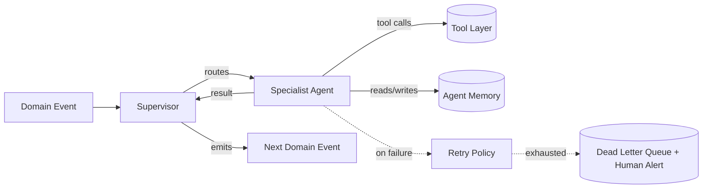

## 8.2 Common Agent Contract

Every agent implements the same interface so the Supervisor can treat them uniformly:

- `input`: typed payload (validated against a Pydantic schema per agent)
- `output`: typed result + confidence/status
- `tools`: an explicit allow-list of callable tools (principle of least privilege — the Email Writer agent, for example, has no database-write tool beyond inserting a draft)
- `memory_scope`: which `agent_memory` rows it may read/write (scoped by `organization_id` and `agent_name`)
- `on_error`: retry policy + fallback behavior
- `success_criteria`: a machine-checkable definition of "did this run succeed" beyond "the API call didn't throw"

## 8.3 Agent Specifications

### 8.3.1 Discovery Agent

- **Purpose:** Find companies matching a tenant's ICP.
- **Responsibilities:** Query business-data providers (see note below), apply ICP filters, dedupe against existing `companies`.
- **Inputs:** ICP definition (industry, geography, size, keywords), exclusion list.
- **Outputs:** New `companies` + `leads` rows (status=`new`).
- **Tools:** `business_directory_search`, `domain_dedup_check`.
- **Memory:** Reads `agent_memory` for "previously disqualified company patterns" to avoid resurfacing bad-fit leads.
- **Decision process:** Rule-based filtering first (hard ICP constraints), LLM-based relevance judgment second (soft-fit scoring on ambiguous cases) — cheap filtering before expensive reasoning.
- **Prompt strategy:** Structured classification prompt with few-shot examples of good/bad fits per tenant vertical.
- **Error handling:** Provider API failure → retry with backoff (3 attempts) → mark discovery job `partial` and alert tenant rather than silently under-delivering.
- **Retry strategy:** Exponential backoff, max 3 attempts, per-provider circuit breaker (stop calling a provider that's erroring >50% over 5 minutes).
- **Communication:** Emits `lead.discovered` per new lead for the Website Analysis Agent to pick up.
- **Success criteria:** ≥1 new non-duplicate lead per discovery run, or an explicit "no new matches" result (not a silent failure).

### 8.3.2 Website Analysis Agent

- **Purpose:** Extract structured signals from a lead's public website.
- **Responsibilities:** Crawl homepage + key subpages, detect tech stack, identify missing/weak features relative to the services LeadForgeAI sells.
- **Inputs:** `company.domain`.
- **Outputs:** `website_analysis` row with `identified_problems` (e.g., "no live chat," "checkout flow is 5 steps," "not mobile-responsive").
- **Tools:** `playwright_crawl`, `tech_stack_detector`, `screenshot_capture`.
- **Memory:** Writes successful "problem→evidence" patterns to `agent_memory` for reuse in explanation generation.
- **Decision process:** Deterministic checks first (page speed, mobile viewport, presence/absence of features via DOM heuristics), LLM synthesis second (turning raw signals into a readable problem list).
- **Prompt strategy:** Given structured crawl data (not raw HTML) to keep context small and cost low; LLM's job is synthesis, not extraction.
- **Error handling:** Site blocks automation (403/CAPTCHA) → fall back to metadata-only analysis (title/meta tags, public API checks) and flag `analysis_confidence: low` rather than failing the lead entirely.
- **Retry strategy:** 1 retry with a different user-agent/backoff; no more, to respect target sites and avoid resembling abuse.
- **Communication:** Emits `analysis.completed` for the Scoring Agent and SEO Agent.
- **Success criteria:** At least one identified problem with supporting evidence, or explicit "no significant issues found" (a legitimate, useful outcome — not every company is a good fit).

### 8.3.3 SEO Analysis Agent

- **Purpose:** Assess search/discoverability health as a complementary signal to the Website Analysis Agent.
- **Inputs:** `company.domain`, `website_analysis.id`.
- **Outputs:** `seo_reports` row (meta issues, core web vitals, mobile-friendliness).
- **Tools:** `lighthouse_runner`, `meta_tag_parser`.
- **Memory:** None required (stateless per-run).
- **Decision process:** Fully deterministic (tooling-based); no LLM call needed for this agent, which keeps its cost near zero.
- **Error handling:** Tooling timeout → retry once → partial report marked `incomplete`.
- **Communication:** Emits `analysis.completed` (joins with Website Analysis Agent's event for the Scoring Agent, which waits for both or a timeout).
- **Success criteria:** Report populated with at least Core Web Vitals + mobile-friendliness fields.

### 8.3.4 Opportunity Scoring Agent

- **Purpose:** Convert raw signals into a single actionable 0–100 score with explanation.
- **Inputs:** `website_analysis`, `seo_reports`, `company` firmographics, historical outcome data for similar leads (via Learning Agent's models).
- **Outputs:** `leads.opportunity_score`, `leads.score_explanation`.
- **Tools:** `feature_weighting_calculator` (deterministic weighted-sum model), LLM only for generating the human-readable explanation text, not the number itself.
- **Memory:** Reads Learning Agent's updated feature weights.
- **Decision process:** Score is computed by a transparent weighted formula (severity × fit × buying-power signals), not an opaque LLM guess — this is a deliberate choice for explainability and consistency; the LLM's role is limited to narrating the *why* in plain English.
- **Error handling:** Missing analysis data → score with reduced confidence and explicit note "based on partial data."
- **Communication:** Emits `score.updated`; if score ≥ tenant's configured qualification threshold, also triggers the Email Personalization Agent.
- **Success criteria:** Score + explanation persisted; explanation must reference at least one concrete piece of evidence (enforced by a post-generation check, not just prompted for).

### 8.3.5 Email Personalization Agent ("Writer")

- **Purpose:** Draft a specific, evidence-referencing first-touch or follow-up email.
- **Inputs:** `lead`, `website_analysis`, `contact`, selected `email_template` (structure/tone guide, not filled boilerplate), tenant's services offered.
- **Outputs:** Draft row in `emails` (status=`draft`) pending send (auto-send optional per tenant settings).
- **Tools:** `genericness_classifier` (self-check before returning), `tone_matcher` (aligns to tenant's configured voice).
- **Memory:** Reads `agent_memory` for high-performing past patterns (by reply rate) for this tenant/vertical.
- **Decision process:** Draft → self-critique pass (does this reference something specific and true?) → regenerate if it fails the genericness check → return.
- **Prompt strategy:** Given structured analysis facts, not asked to "write a cold email" generically — the prompt requires citing at least one `identified_problems` entry verbatim by reference id.
- **Error handling:** Fails genericness check twice → escalate to human review queue rather than sending a weak email.
- **Retry strategy:** Max 2 regeneration attempts before human escalation.
- **Communication:** Notifies user (`notifications`) that a draft is ready; on tenant auto-send setting, emits `email.ready_to_send` to the Campaign Service.
- **Success criteria:** Passes genericness/quality gate; references verifiable analysis evidence.

### 8.3.6 Proposal Writer Agent

- **Purpose:** Draft a proposal + quotation from deal context.
- **Inputs:** `deal`, selected services, scope notes from the sales rep, pricing rules.
- **Outputs:** `proposals` row (draft), `quotations` row.
- **Tools:** `pricing_calculator`, `pdf_renderer`.
- **Memory:** Reads past accepted proposals (by this tenant) as style/structure reference via embeddings similarity search.
- **Decision process:** Structure is templated (fixed sections: problem summary, proposed solution, scope, pricing, timeline, terms); LLM fills each section from deal context rather than free-writing the whole document, keeping output consistent and reviewable.
- **Error handling:** Missing required pricing input → does not generate a total; returns a draft flagged "pricing incomplete" rather than guessing a number.
- **Communication:** Notifies assigned rep for review before send.
- **Success criteria:** All required sections populated; total in quotation matches sum of line items (validated programmatically, not just trusted from the LLM).

### 8.3.7 CRM Assistant Agent

- **Purpose:** Answer natural-language questions about pipeline state and perform bounded CRM actions on request ("move this deal to Proposal Sent," "summarize this week's activity").
- **Inputs:** User's chat message, relevant CRM context (deal/pipeline data fetched by tool call, not pre-loaded wholesale).
- **Outputs:** Chat response + optional CRM mutation (with confirmation for destructive actions).
- **Tools:** `deal_query`, `deal_update` (guarded — respects the same RBAC as the human user issuing the request), `activity_summarizer`.
- **Memory:** `ai_conversations` history for context continuity.
- **Error handling:** Ambiguous instruction → asks a clarifying question rather than guessing which deal/record is meant.
- **Success criteria:** No mutation is performed without unambiguous target identification; every mutation is logged to `audit_logs` with actor `agent:crm_assistant` and the initiating user id.

### 8.3.8 Follow-up Agent

- **Purpose:** Manage multi-step sequences and cancel them appropriately.
- **Inputs:** `outreach_campaigns.sequence_steps`, `emails` thread status.
- **Outputs:** Scheduled follow-up email drafts at configured delays.
- **Tools:** `sequence_scheduler` (BullMQ delayed jobs), `reply_detector` (via `email.replied` event).
- **Decision process:** Before firing each scheduled step, re-checks thread state — if a reply, bounce, or unsubscribe occurred, the step is cancelled (Business Rule §2.4/US-3).
- **Error handling:** Sending mailbox integration disconnected → pause sequence, alert tenant, do not silently drop it.
- **Communication:** Consumes `email.replied`/`email.bounced`; emits `followup.sent` or `followup.canceled`.
- **Success criteria:** Zero follow-ups sent after a detected reply (hard invariant, tested explicitly in §18).

### 8.3.9 Meeting Scheduler Agent

- **Purpose:** Facilitate meeting booking once a prospect expresses interest.
- **Inputs:** Deal context, rep's connected calendar availability.
- **Outputs:** Scheduling link inserted into a reply draft, and/or `meetings` row once booked via webhook from the calendar provider.
- **Tools:** `calendar_availability_check`, `scheduling_link_generator`.
- **Error handling:** Calendar integration missing → falls back to suggesting the rep propose times manually.
- **Communication:** Emits `meeting.booked` on confirmed booking.
- **Success criteria:** Booked meeting correctly linked to the originating deal (no orphaned meetings).

### 8.3.10 Reporting Agent

- **Purpose:** Generate natural-language summaries of dashboard/report data on request or on a schedule (e.g., "Monday morning pipeline summary").
- **Inputs:** Materialized view query results.
- **Outputs:** Summary text + suggested next actions.
- **Tools:** `analytics_query` (read-only).
- **Error handling:** No data for period → explicitly states that, never fabricates a trend.
- **Success criteria:** Every numeric claim in the summary is traceable to a query result (post-generation validation checks numbers against source data).

### 8.3.11 Learning Agent

- **Purpose:** Continuously improve scoring weights and prompt/template selection using outcome data.
- **Inputs:** Aggregated outcome data (`email.replied`, `meeting.booked`, `deal.won`/`deal.lost`) joined against the analysis/score/email data that produced them.
- **Outputs:** Updated scoring feature weights, updated ranking of `email_templates`/prompt variants by measured performance, curated entries into `agent_memory`.
- **Tools:** `outcome_aggregator`, `ab_test_evaluator`.
- **Decision process:** Statistical (sample-size-gated) — a template isn't deprioritized on 3 sends; changes require a minimum sample size and significance threshold before being applied, avoiding noisy overfitting to small samples.
- **Error handling:** Insufficient data → no-op (explicitly logged as "insufficient sample," not treated as failure).
- **Communication:** Runs on a schedule (weekly), emits `weights.updated` consumed by Scoring Agent and Writer Agent on their next run.
- **Success criteria:** Any weight/template change is accompanied by a logged rationale (sample size, effect size) for auditability — no silent black-box drift.

### 8.3.12 Supervisor Agent

- **Purpose:** Route events to the correct specialist, enforce sequencing/dependencies, and manage cross-agent failure escalation.
- **Inputs:** Domain events from the event bus.
- **Outputs:** Routed tasks; a run-level `agent_logs` entry summarizing the full multi-agent chain for a given lead/deal (useful for support/debugging "why did this lead get this score").
- **Decision process:** Deterministic routing table (event type → agent), not an LLM decision — routing correctness matters more than routing "intelligence," so this stays rule-based and fast.
- **Error handling:** If a specialist exhausts retries, the Supervisor writes to the dead-letter queue and raises a `notifications` alert to org admins rather than letting the pipeline silently stall.
- **Success criteria:** Every event either results in a terminal successful state or a visible, actionable failure state — nothing is ever "stuck" invisibly.

## 8.4 Note on Data Providers

"Business directory search" in the Discovery Agent is implemented against licensed B2B data providers (e.g., business registries, opt-in B2B contact databases) rather than scraping personal data — this is a deliberate compliance boundary consistent with the constraints in §2.6 and the ethical safeguards in §14.


---

# 9. Workflow Documentation

## 9.1 Lead Discovery Workflow

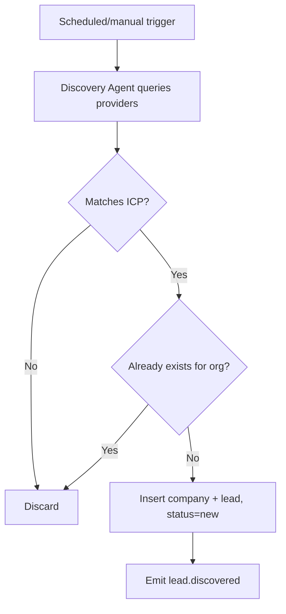

## 9.2 Website Analysis Workflow

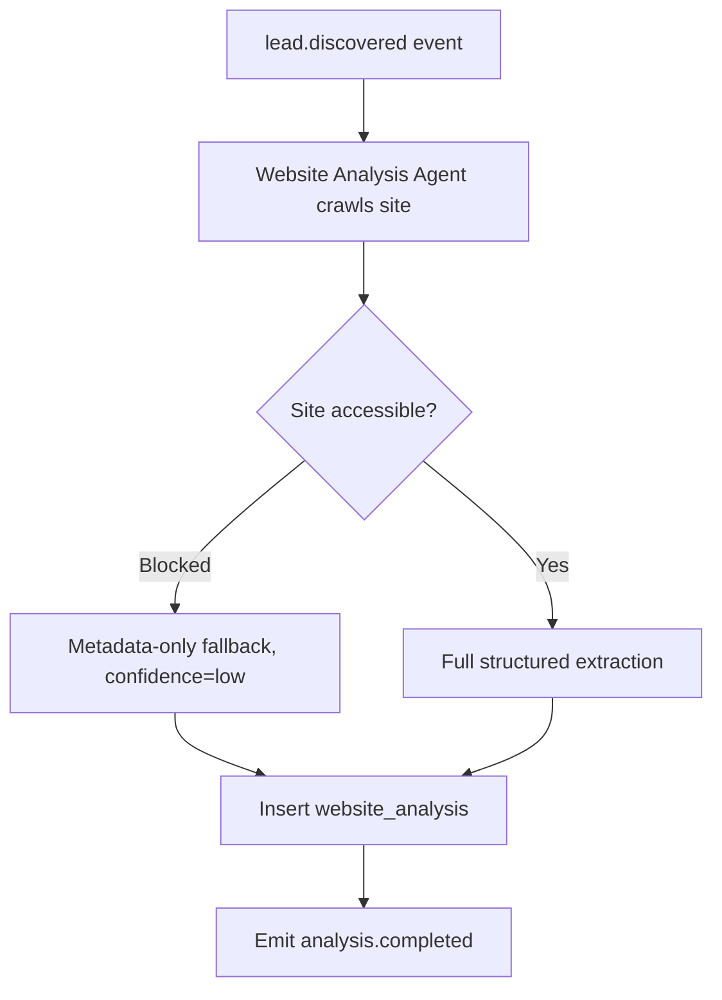

## 9.3 Lead Qualification (Scoring) Workflow

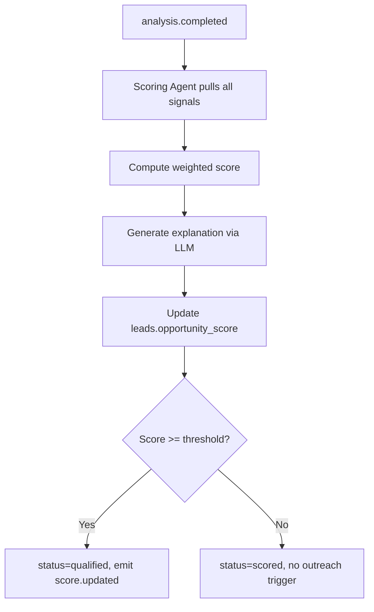

## 9.4 Outreach Generation & Sending Workflow

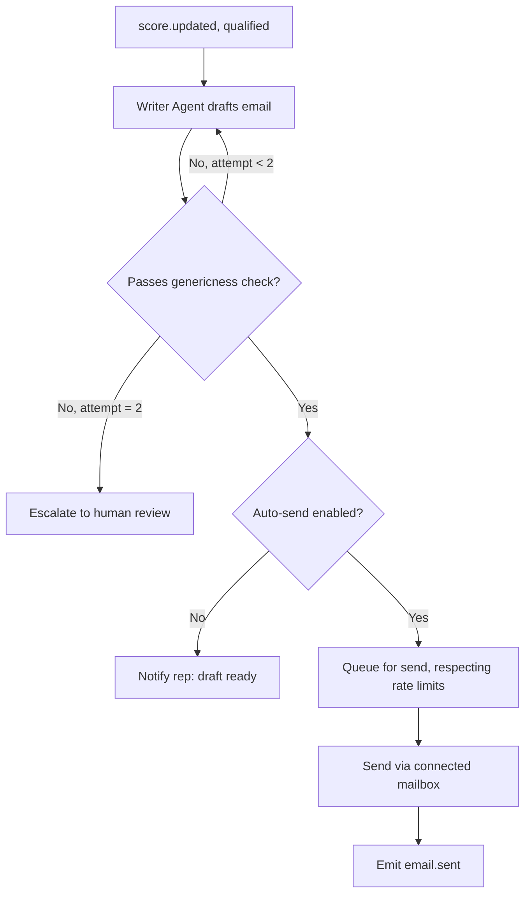

## 9.5 Follow-up Scheduling Workflow

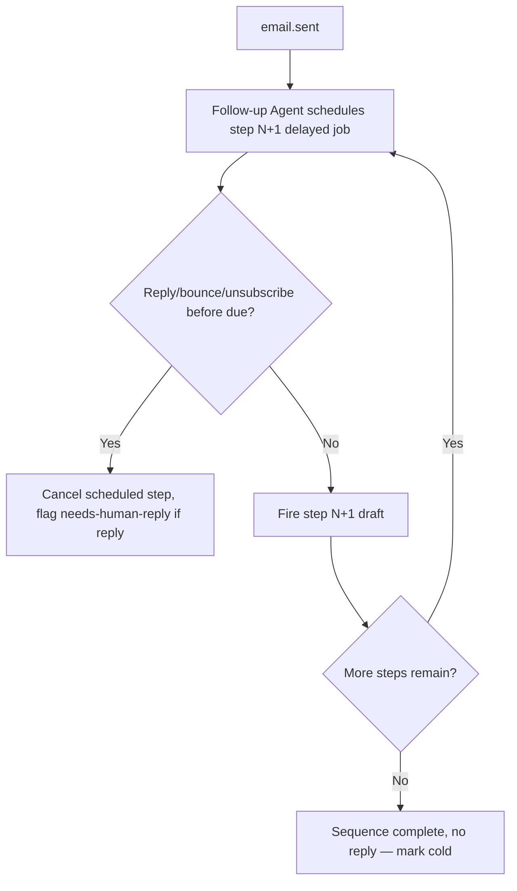

## 9.6 Meeting Booking Workflow

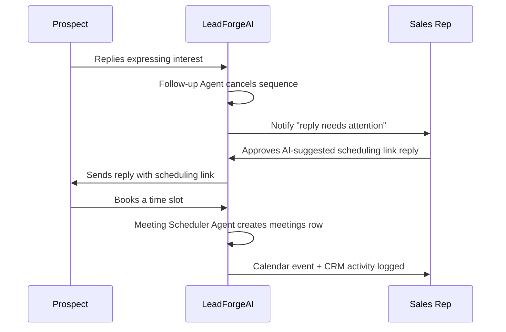

## 9.7 Proposal & Quotation Generation Workflow

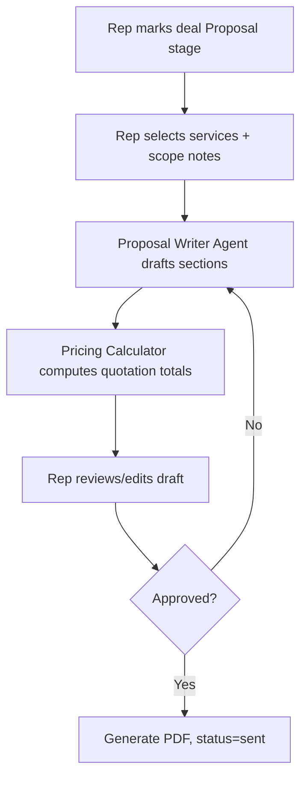

## 9.8 Client Conversion Workflow

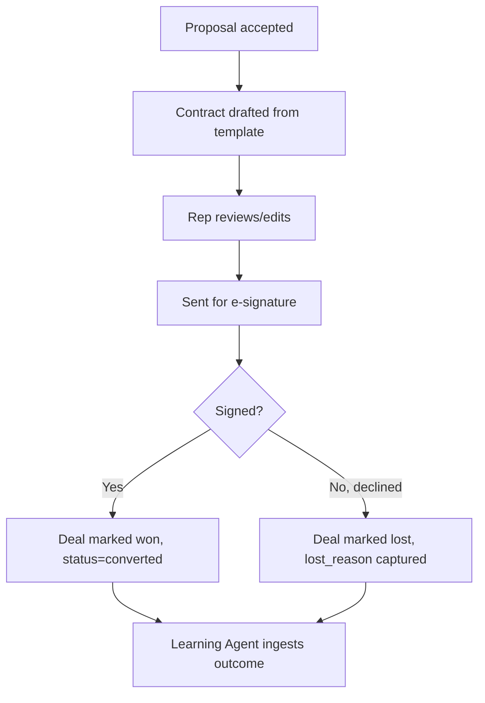

## 9.9 Reporting Workflow

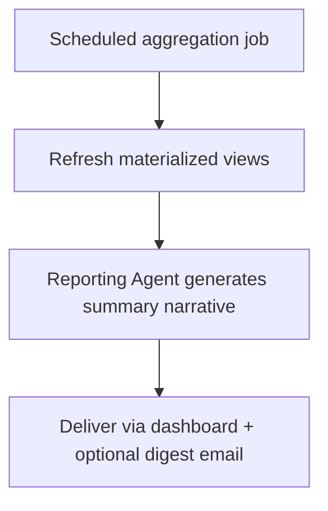

## 9.10 Learning Loop Workflow

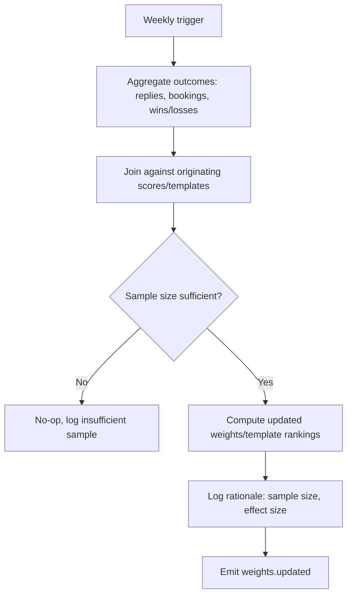

## 9.11 Campaign Analytics Workflow

Campaign analytics are computed continuously via incrementally-refreshed materialized views (`mv_campaign_performance_daily`) keyed by `campaign_id` and `date`, exposed through the Reporting Service's API and rendered on the Campaign Manager and Analytics pages (§10).


---

# 10. Frontend Architecture

Built with React 18 + TypeScript + Vite, Tailwind + shadcn/ui, TanStack Query for server state, Zustand for light client state (see §4.1). Every page below supports **dark mode** (class-based Tailwind theming, persisted per-user preference) and is responsive down to tablet width at minimum (mobile-optimized for the Dashboard, Lead Explorer, and Notifications; power-user pages like Campaign Manager are desktop-first with a functional, if denser, mobile fallback).

## 10.1 Landing Page
- **Purpose:** Public marketing entry point, trial signup conversion.
- **Layout:** Hero, value prop sections, pricing table, testimonials, CTA footer.
- **Components:** Pricing cards, FAQ accordion, signup form.
- **Accessibility:** Semantic landmarks, full keyboard navigation, WCAG AA contrast.

## 10.2 Authentication
- **Purpose:** Sign up, log in, SSO, password reset, org invite acceptance.
- **Layout:** Centered card, minimal chrome.
- **Components:** Form inputs with inline validation, OAuth buttons (Google/Microsoft), invite-acceptance flow with pre-filled org context.

## 10.3 Dashboard
- **Purpose:** At-a-glance health of pipeline, campaigns, and recent AI activity.
- **Layout:** KPI card row (top), recent activity feed (left), pipeline funnel chart + top-scored leads (right).
- **Components:** Cards, Recharts funnel/line charts, activity feed list, quick-action buttons ("Run discovery," "Review drafts").
- **Filters/Search:** Date-range selector for KPIs.
- **Responsive:** Cards reflow to single column on mobile; charts simplify to sparkline form.

## 10.4 CRM (Pipeline Board)
- **Purpose:** Visual, drag-and-drop deal management.
- **Layout:** Kanban board, one column per pipeline stage.
- **Components:** Deal cards (contact, company, value, score badge), drag-and-drop (via `@dnd-kit`), stage-add/edit dialog, deal quick-view side panel.
- **Filters/Search/Sort:** Filter by owner, value range, score; search by company/contact name.
- **Dialogs:** New deal, edit stage, lost-reason capture.
- **Responsive:** Collapses to a stage-selectable list view on mobile (true multi-column kanban isn't usable on small screens).

## 10.5 Lead Explorer
- **Purpose:** Browse, filter, and triage AI-discovered leads.
- **Layout:** Data table (primary) with a filter sidebar.
- **Components:** Sortable/paginated table (score, company, industry, status columns), score-explanation tooltip/popover, bulk-action toolbar (bulk-qualify, bulk-disqualify, bulk-add-to-campaign).
- **Filters/Search:** Score range, industry, status, "has identified problem X."
- **Pagination:** Cursor-based (stable under concurrent inserts from ongoing discovery jobs).

## 10.6 Company Detail
- **Purpose:** Full context on one company: analysis findings, contacts, associated leads/deals.
- **Layout:** Header (name, domain, score), tabbed body (Overview / Website Analysis / SEO / Contacts / Activity).
- **Components:** Analysis findings list with evidence links, screenshot preview, contact cards, embedded activity timeline (shared component with CRM).

## 10.7 Website Analysis (Detail View)
- **Purpose:** Deep-dive into a single analysis run.
- **Layout:** Split view — screenshot/preview left, structured findings right.
- **Components:** Performance/accessibility score gauges, identified-problems list with severity badges, "regenerate analysis" action.

## 10.8 Campaign Manager
- **Purpose:** Create/manage outreach campaigns and sequences.
- **Layout:** Campaign list table → campaign detail (sequence builder + performance stats).
- **Components:** Sequence-step builder (add/reorder/delay-configure steps), template picker, sending-mailbox selector, performance chart (sent/opened/replied over time).
- **Filters/Search:** By status, by template.

## 10.9 Email Composer
- **Purpose:** Review/edit AI-drafted emails before send.
- **Layout:** Split view — draft editor left, source evidence (analysis findings referenced) right for reviewer confidence.
- **Components:** Rich-text editor, "regenerate" button, genericness-check indicator, send/schedule controls.

## 10.10 Proposal Generator
- **Purpose:** Review/edit AI-drafted proposals and quotations.
- **Layout:** Document-style editor with section navigation sidebar.
- **Components:** Editable sections, line-item table (quotation), PDF preview pane, "send for signature" action.

## 10.11 AI Chat
- **Purpose:** Conversational interface to the CRM Assistant Agent.
- **Layout:** Standard chat UI with a context panel showing the entity (deal/lead) currently in focus, if any.
- **Components:** Message list, input box with slash-command suggestions, confirmation modal for any mutating action the assistant proposes.

## 10.12 Reports
- **Purpose:** Structured, exportable reports (pipeline, campaign, agent performance).
- **Layout:** Report-type selector, filter bar, chart + table body, export button.
- **Components:** Recharts visualizations, data table with CSV export, saved-report presets.

## 10.13 Analytics
- **Purpose:** Deeper self-serve exploration of performance trends.
- **Layout:** Dashboard-of-dashboards — multiple chart panels, configurable date range and grouping.
- **Components:** Multi-select filters, comparison mode (period-over-period), drill-down click-through to underlying leads/deals.

## 10.14 Settings
- **Purpose:** Org-level configuration (ICP defaults, sending limits, AI model tier, branding).
- **Layout:** Settings sidebar with sub-sections.
- **Components:** Forms, toggles, ICP builder widget.

## 10.15 Billing
- **Purpose:** Plan management, invoices, payment method.
- **Layout:** Current plan card, usage meters (AI credits consumed), invoice history table.
- **Components:** Stripe-hosted payment element embed, plan-upgrade comparison modal.

## 10.16 User Management
- **Purpose:** Invite/manage team members and roles.
- **Layout:** User table with role badges.
- **Components:** Invite dialog, role editor, deactivate/reactivate actions (RBAC-gated).

## 10.17 Notifications
- **Purpose:** Central feed of alerts (draft ready, reply needs attention, sequence paused, agent error escalation).
- **Layout:** Dropdown panel from top nav + dedicated full page.
- **Components:** Notification list with read/unread state, type-based icons, click-through to source entity.


---

# 11. Backend Architecture

## 11.1 API Conventions

- **Style:** REST, JSON bodies, resource-oriented URLs (`/v1/leads/{id}`), standard HTTP verbs/status codes.
- **Versioning:** URL-path versioning (`/v1/...`); breaking changes ship as `/v2` with the prior version maintained through a documented deprecation window (minimum 6 months).
- **Pagination:** Cursor-based (`?cursor=...&limit=...`) on all list endpoints, returning `next_cursor` in the response envelope — stable under concurrent inserts, unlike offset pagination.
- **Response envelope:**
```json
{
  "data": { },
  "meta": { "next_cursor": "..." },
  "error": null
}
```
- **Error envelope:**
```json
{
  "data": null,
  "error": { "code": "VALIDATION_ERROR", "message": "...", "details": [ ] }
}
```

## 11.2 Representative Endpoints

| Method | Path | Purpose |
|---|---|---|
| POST | `/v1/auth/login` | Authenticate, issue JWT + refresh token |
| POST | `/v1/auth/refresh` | Rotate access token |
| GET | `/v1/leads` | List leads (filter/sort/paginate) |
| POST | `/v1/leads/discover` | Trigger a discovery job for the org's ICP |
| GET | `/v1/leads/{id}` | Lead detail incl. analysis + score explanation |
| PATCH | `/v1/leads/{id}` | Update status/services_of_interest |
| GET | `/v1/companies/{id}` | Company detail |
| POST | `/v1/campaigns` | Create campaign |
| POST | `/v1/campaigns/{id}/activate` | Activate a draft campaign |
| GET | `/v1/deals` | List deals (kanban data) |
| PATCH | `/v1/deals/{id}/stage` | Move a deal between pipeline stages |
| POST | `/v1/deals/{id}/proposals` | Trigger Proposal Writer Agent |
| POST | `/v1/proposals/{id}/send` | Send proposal for signature |
| GET | `/v1/reports/pipeline-funnel` | Aggregated funnel data |
| POST | `/v1/ai/chat` | Send a message to the CRM Assistant Agent |
| GET | `/v1/notifications` | List notifications |
| POST | `/v1/integrations/{provider}/connect` | Start OAuth connect flow |

## 11.3 Authentication & Authorization

- **Authentication:** JWT access tokens (15 min expiry) + rotating refresh tokens (7-day expiry, stored hashed in `sessions`), verified at the API Gateway before any request reaches a domain service.
- **Authorization:** RBAC checked per-endpoint using the caller's `role_id` → `permissions` join (§7.3.3); enforced both at the Gateway (coarse — "can this role hit this route at all") and at the service layer (fine — "can this role delete *this specific* deal," incorporating ownership rules where relevant).
- **Multi-tenancy enforcement:** Every service call runs within a Postgres transaction that sets `app.current_org` from the verified JWT's `organization_id` claim, activating Row-Level Security — a compromised or buggy query cannot cross tenant boundaries even if application logic has a mistake.

## 11.4 Validation

Request bodies validated against DTO schemas (NestJS `class-validator` decorators / Pydantic models on the Python side) at the boundary; invalid requests are rejected with `422` and field-level error details before touching business logic.

## 11.5 Rate Limiting

- **Per-user/API-key:** token-bucket rate limiting at the Gateway (e.g., 100 req/min default, configurable per plan tier).
- **Per-tenant sending limits:** enforced independently in the Campaign Service (not just a generic API rate limit) since email-send abuse risk is qualitatively different from read-endpoint abuse risk (§13, §15).

## 11.6 Error Handling & Logging

- Uniform error envelope (§11.1) across all services; internal error codes mapped to safe, non-leaky user-facing messages.
- All requests logged with a correlation/request ID propagated across service calls and into `agent_logs`/`error_logs`, so a single trace can be reconstructed end-to-end from Gateway → domain service → agent → database — critical for debugging multi-agent chains.


---

# 12. CRM Architecture

## 12.1 Sales Pipeline

Pipelines are tenant-configurable (`pipelines.stages` JSONB ordered array), defaulting to a standard template on org creation: `New → Contacted → Engaged → Proposal Sent → Negotiation → Won/Lost`. Multiple pipelines per org are supported (e.g., separate pipelines for "Website Projects" vs. "Ongoing Automation Retainers").

## 12.2 Opportunity Management

Deals (`deals` table) are the unit of pipeline management, one per lead-that-became-an-opportunity. A single company may have multiple deals over time (repeat business), each independently tracked.

## 12.3 Task Management

Tasks (`tasks`) can be freestanding or deal-attached, assignable to any org member, surfaced on the Dashboard and as due-date notifications.

## 12.4 Activity Timeline

All CRM-relevant events — emails, calls (manually logged), meetings, notes, stage changes, and AI actions — write to the single `activities` table with a typed `payload`, rendered as one unified, chronologically sorted timeline component reused across the CRM board's deal panel and the Company Detail page. This unification (rather than separate UI for "emails" vs "notes" vs "stage history") is deliberate: reps should see one coherent story per deal, not four disconnected feeds.

## 12.5 Contact Management

Contacts are company-scoped (§7.3.5) with `email_status` tracked to enforce sending compliance rules regardless of which campaign or agent initiates a send.

## 12.6 Meeting Tracking

Meetings link to deals and, where a calendar integration exists, sync bidirectionally (booking creates the CRM record; external cancellation updates status).

## 12.7 Proposal Tracking

Proposals carry a lifecycle status (`draft → sent → viewed → accepted/declined`) with `viewed` populated via a tracked view-link (tracking pixel/redirect equivalent for PDF/web-view opens), giving reps visibility into engagement before a reply arrives.

## 12.8 Email History

All emails (in/outbound) tied to a `deal_id` where applicable appear in that deal's activity timeline; tenant-wide email history is also queryable independently via the Campaign Manager for campaign-level (not deal-level) analysis.

## 12.9 Notes

Freeform, author-attributed, deal-scoped; rendered inline in the activity timeline in chronological position (not a separate tab), so a note explaining "why we moved this to Negotiation" sits next to the stage-change event it explains.

## 12.10 Tags

A lightweight `tags TEXT[]` column (denormalized, GIN-indexed) on `companies` and `deals` supports free-form tenant categorization without requiring a full normalized tagging subsystem at this stage; revisit as a proper `tags`/`taggables` join-table structure if cross-tenant tag analytics become a product requirement.

## 12.11 Lead Scoring

Surfaced throughout the CRM (not just the Lead Explorer) — deal cards show the originating lead's score badge, and the score explanation is one click away, so reps always know *why* a deal was worth pursuing.

## 12.12 Automation

Tenant-configurable automation rules (`workflows` table, Phase 2+ per §19) allow simple trigger→action definitions (e.g., "when deal enters Negotiation for >5 days with no activity, create a task") without requiring code — a rules engine evaluated by a scheduled worker, not by an LLM, since deterministic rule execution is what this feature needs.


---

# 13. Email System

## 13.1 SMTP / OAuth Sending

Outreach is sent through the tenant's own connected mailbox via OAuth (Gmail API / Microsoft Graph — no raw SMTP credential storage), preserving sender authenticity (SPF/DKIM/DMARC pass naturally since it *is* the sender's real domain) and putting deliverability reputation management in the tenant's own hands rather than a shared pool. System/transactional emails (invoices, password resets, digest notifications) go through Postmark on a LeadForgeAI-controlled, reputation-managed domain.

## 13.2 Templates

`email_templates` define reusable structure/tone (not filled content) that the Writer Agent uses as a scaffold; tenants can also hand-author fully static templates for non-AI use cases.

## 13.3 Campaigns

`outreach_campaigns` group a template + sequence definition + sending mailbox; campaign-level stats (sent/opened/replied/bounced) roll up from individual `emails` rows via the materialized reporting views (§7.5, §9.11).

## 13.4 Open Tracking

Standard tracking-pixel approach (transparent 1×1 image with a unique per-email token) recording `opened_at` on first load; documented to tenants as best-effort (blocked by many mail clients' image-proxying/privacy features) rather than authoritative, to set correct expectations.

## 13.5 Reply Tracking

An inbox poller (via the connected mailbox's API, not IMAP scraping) watches for replies on tracked threads (matched via `provider_message_id`/thread id), emitting `email.replied` — this is the signal that halts follow-up sequences (§8.3.8, US-3).

## 13.6 Bounce Handling

Hard bounces detected via provider bounce webhooks/status set `contacts.email_status = 'bounced'` immediately, which is checked as a hard gate before any future send to that contact regardless of which campaign or agent initiates it (enforced at the send-service layer per Business Rule §2.4, not just at campaign-creation time).

## 13.7 Scheduling

Sends are scheduled respecting: tenant-configured sending windows (e.g., business hours in the recipient's timezone), per-mailbox daily volume caps, and global minimum-delay-between-sends-per-domain rules to mimic natural human sending patterns rather than bulk-blast timing.

## 13.8 Compliance

- CAN-SPAM: physical address footer, functional unsubscribe link, honest subject lines (enforced via template validation, not just policy documentation) — no falsified header/routing information.
- CASL/GDPR: only business contacts with a lawful basis (legitimate interest for B2B outreach, jurisdiction-dependent) are contactable; unsubscribe/opt-out is immediate and propagates to `email_status = 'unsubscribed'` platform-wide, not just within one campaign.
- Suppression list is enforced tenant-wide and is never bypassable by re-import of the same contact.

## 13.9 Deliverability

- Rate limiting and volume ramp-up ("warm-up") guidance are enforced defaults for newly connected mailboxes, not opt-in advice — a brand-new sending mailbox is capped at a low daily volume that increases gradually.
- Per-mailbox sending-health scoring (bounce rate, spam-complaint rate where available via provider feedback loops) automatically throttles or pauses a mailbox trending toward reputation damage, protecting the tenant (and, since domains are tenant-owned rather than shared, other tenants are structurally unaffected — see §3.2/§4.11 rationale).


---

# 14. Browser Automation

## 14.1 Playwright Architecture

A dedicated **Browser Automation Farm** — a pool of containerized, isolated Playwright worker processes — consumes jobs from `queue:browser-automation`. Each job runs in a fresh browser context (no shared cookies/state across jobs) to avoid cross-tenant/cross-target contamination and to keep each crawl a clean, reproducible snapshot.

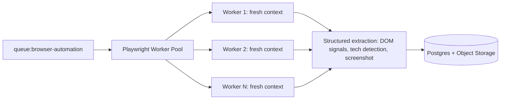

## 14.2 Scraping Strategy

Only publicly accessible marketing/business pages are crawled (homepage + a small set of key subpages: about, services/pricing, contact). No authentication bypass, no crawling behind login walls, no collection of end-user/consumer personal data — the target is business signals (tech stack, feature presence, page performance), not people.

## 14.3 Rate Limiting

Per-domain concurrency cap (default: 1 concurrent request per target domain) and minimum delay between requests to the same domain, independent of overall worker-pool capacity — protects target sites from load regardless of how many leads LeadForgeAI is processing tenant-wide.

## 14.4 Robots.txt & Ethical Safeguards

- `robots.txt` is fetched and respected before crawling any page beyond the root.
- A documented, versioned crawl policy governs what is and isn't collected (business/technical signals only; explicitly excludes any personal data scraping beyond publicly listed business contact details already intended for outreach purposes).
- Standard, transparent user-agent string identifying the crawler (not a spoofed browser UA designed to evade detection) — consistent with treating target sites' access preferences as a real constraint, not an obstacle to route around.

## 14.5 Website Analysis Workflow (Automation Detail)

1. Fetch `robots.txt`; abort disallowed paths.
2. Load homepage in an isolated context; capture DOM, network requests (for tech detection), and a screenshot.
3. Run deterministic checks (page speed proxy, mobile viewport meta, presence/absence of key DOM patterns like chat widgets/booking forms).
4. Optionally fetch 1–2 additional key subpages (services/contact) if linked from homepage nav.
5. Return structured JSON to the Website Analysis Agent for LLM synthesis (§8.3.2) — raw HTML is not passed to the LLM, keeping prompt size and cost bounded.

## 14.6 Failure Handling

| Failure | Handling |
|---|---|
| `robots.txt` disallows | Skip crawl entirely; metadata-only (public DNS/WHOIS-level) fallback if any |
| CAPTCHA/bot-challenge encountered | Abort immediately (no CAPTCHA-solving attempted — an explicit ethical/legal line); mark `analysis_confidence: low` |
| Timeout | One retry with backoff; then fallback |
| Site down / DNS failure | Mark company `unreachable`, retry on next scheduled discovery cycle rather than blocking the pipeline |


---

# 15. Security Architecture

## 15.1 Authentication & Authorization

JWT access + refresh tokens (§11.3); OAuth2 for third-party integrations. Passwords hashed with Argon2id (memory-hard, resistant to GPU cracking, current best-practice over bcrypt for new systems). MFA (TOTP) supported and required for Owner/Admin roles on paid plans.

## 15.2 RBAC

Roles/permissions modeled relationally (§7.3.3), checked at both Gateway (route-level) and service (record-level, including ownership checks) layers — defense in depth rather than a single enforcement point.

## 15.3 JWT

Short-lived access tokens (15 min) limit the blast radius of a leaked token; refresh tokens are rotated on every use (old refresh token invalidated) and stored hashed, so a stolen refresh token can be revoked and detected (reuse of an already-rotated token triggers session invalidation and an alert — a standard "refresh token reuse detection" pattern).

## 15.4 Encryption

- **In transit:** TLS 1.2+ everywhere (Nginx terminates, internal Docker-network traffic also encrypted where it crosses host boundaries).
- **At rest:** Database-level encryption (managed Postgres provider's disk encryption, or LUKS on the VPS); sensitive columns (OAuth tokens in `integrations`) additionally application-layer encrypted (AES-256-GCM) with keys held in the secrets manager, not the database itself — so a database dump alone doesn't expose live OAuth tokens.

## 15.5 Secrets Management

Doppler/Vault (§5.6) — no secrets in source control, no secrets in plain `.env` on production hosts; CI/CD injects at deploy time; secret rotation procedure documented and tested.

## 15.6 Backups

Automated daily full + continuous WAL-based point-in-time recovery (§3.15); backups encrypted at rest and stored off the primary host; quarterly restore drills to verify backups are actually usable, not just present.

## 15.7 Audit Logs

Append-only `audit_logs` table (§7.3.19) with no application-level UPDATE/DELETE grant; every mutating action across every service writes an entry, including AI-agent-initiated mutations (attributed to the agent identity plus the human who approved/triggered it where applicable).

## 15.8 CSRF / XSS / SQL Injection

- **CSRF:** SameSite=Strict cookies where cookies are used (refresh token storage); JWT-in-header pattern for API calls, which is inherently CSRF-resistant since browsers don't auto-attach custom headers.
- **XSS:** React's default escaping + a strict Content-Security-Policy header; any rendering of AI-generated or user-generated rich content (proposal editor, email drafts) is sanitized through an allow-list HTML sanitizer before render, never `dangerouslySetInnerHTML` on raw content.
- **SQL Injection:** All database access through parameterized queries/ORM (TypeORM/Prisma-style or SQLAlchemy) — no raw string-concatenated SQL, enforced via lint rule + code review checklist.

## 15.9 API Security

- Every API key (`api_keys`) stored hashed (never plaintext after creation-time display), scoped to specific permissions, revocable, and last-used-tracked for anomaly detection.
- Webhook endpoints (Stripe, calendar providers) verify provider signatures before processing payloads.

## 15.10 Rate Limiting & Secure Headers

Gateway-level rate limiting (§11.5); standard secure headers (CSP, `X-Content-Type-Options: nosniff`, `Strict-Transport-Security`, `X-Frame-Options: DENY`) applied via a shared Nginx/middleware config, not left to individual services to remember.

## 15.11 Data Protection & Compliance Considerations

- Multi-tenant isolation via Row-Level Security (§7.1) as the primary safeguard against cross-tenant data leakage.
- GDPR/UK-GDPR data-subject rights (access, erasure) supported via a dedicated purge job that hard-deletes (not soft-deletes) a data subject's records across all tables on verified request, with the action itself logged to `audit_logs` before the erasure completes (log first, so the erasure's own audit trail survives).
- SOC 2 readiness treated as a target operating posture from day one (access reviews, least-privilege infrastructure access, documented incident response plan) even before a formal audit is pursued, since retrofitting these controls later is materially more expensive than building on them from the start.


---

# 16. DevOps Architecture

## 16.1 Docker & Docker Compose

Each service ships a multi-stage Dockerfile (build stage → slim runtime stage) to minimize image size and attack surface. `docker-compose.prod.yml` defines resource limits (`mem_limit`, `cpus`) per container so a runaway process (e.g., an unbounded Playwright job) can't starve the host.

## 16.2 Reverse Proxy / SSL / Nginx

Nginx terminates TLS (Let's Encrypt via Certbot, auto-renewal cron), reverse-proxies to the Web App and API Gateway containers, and applies the secure-header baseline (§15.10) at a single, auditable layer.

## 16.3 CI/CD (GitHub Actions)

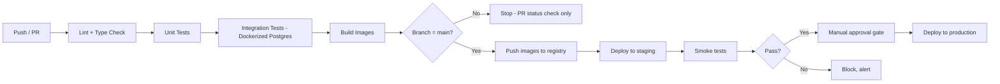

## 16.4 Deployment & Rollback

Deployments are versioned by image tag (git SHA); rollback is a one-command redeploy of the previous known-good tag via the same Compose/CI pipeline — no manual server surgery. Database migrations are additive-first (expand/contract pattern: add new columns/tables before removing old ones) so a rollback of application code doesn't require an immediate matching schema rollback.

## 16.5 Scaling

Vertical scaling (bigger VPS tier) is the first lever (§3.13); horizontal scaling of stateless containers (multiple replicas behind Nginx `upstream` blocks, or a move to k3s) is the second lever, triggered by sustained CPU/memory thresholds or queue-depth SLA breaches rather than pre-emptively over-provisioned.

## 16.6 Backups & Log Rotation

Automated nightly Postgres backups (§3.15) shipped off-host; Docker's `json-file` log driver configured with `max-size`/`max-file` rotation limits so container logs can't fill the VPS disk; aggregated logs additionally flow to Loki/Grafana (§4.10) for durable, queryable retention independent of local disk rotation.


---

# 17. Monitoring

## 17.1 Metrics

Prometheus scrapes per-service metrics (request rate/latency/error rate, queue depth per BullMQ queue, DB connection pool utilization, agent run counts/latency/cost from `agent_logs`); Grafana dashboards visualize these per-service and platform-wide.

## 17.2 Health Checks

Every service exposes a `/health` endpoint (checked by Docker healthcheck + an external uptime monitor) distinguishing **liveness** (process is up) from **readiness** (dependencies like Postgres/Redis are reachable) so orchestration doesn't route traffic to a container that's up but not actually functional.

## 17.3 Performance Monitoring

Sentry Performance (or equivalent APM tracing) tracks slow transactions end-to-end, correlated via the request ID propagated through the system (§11.6), making it possible to see exactly which agent call or DB query is the bottleneck in a slow multi-agent chain.

## 17.4 Error Tracking

Sentry aggregates and groups errors across Node, Python, and React; `error_logs` (§7.3.21) provides a tenant-queryable, support-facing complement for debugging a specific customer's issue without needing Sentry access.

## 17.5 Alerting

Threshold- and anomaly-based alerts (Grafana Alerting / Sentry alert rules) route to a shared on-call channel for: elevated error rate, queue backlog beyond SLA, sending-mailbox reputation-risk flags, and agent dead-letter-queue growth (§8.3.12) — the last of these is treated as a first-class alert since a silently stuck pipeline directly harms customer trust.

## 17.6 Logging Strategy

Structured JSON logs (not free-text) from every service, including the correlation/request ID, tenant id (where applicable), and service name on every line, shipped to Loki for queryable aggregation.

## 17.7 Dashboard Metrics

Platform-operator Grafana dashboards track: active tenants, discovery jobs/day, analyses/day, emails sent/day, average opportunity score, agent cost per tenant (for unit-economics visibility), and P95 latency per core endpoint.


---

# 18. Testing Strategy

## 18.1 Unit Tests

Jest (Node services) / Pytest (Python agent services) covering business logic in isolation — scoring formula math, pricing calculator, RBAC permission checks, and each agent's decision-logic functions with mocked LLM/tool calls.

## 18.2 Integration Tests

Service-level tests against a real (Dockerized, ephemeral) Postgres instance verify actual queries, migrations, and RLS policies behave as designed — RLS in particular is tested explicitly (attempt cross-tenant read/write, assert rejection) since it's the platform's most safety-critical invariant.

## 18.3 API Tests

Supertest/httpx-driven contract tests hit real HTTP endpoints end-to-end (Gateway → service → DB) validating request/response envelopes, error codes, pagination behavior, and auth/authz enforcement.

## 18.4 UI Tests

React Testing Library for component-level behavior (forms, dialogs, table interactions); critical user flows (login, kanban drag-and-drop, campaign creation) also covered by Playwright E2E against a running staging environment.

## 18.5 Load Tests

k6 scripts simulate realistic concurrent tenant traffic against the Gateway and, separately, sustained queue throughput against the worker tier, validating the scalability assumptions in §3.13 before they're needed in production rather than discovering limits under real customer load.

## 18.6 Security Tests

Automated dependency-vulnerability scanning (`npm audit`/`pip-audit`) in CI; scheduled (quarterly minimum) third-party penetration testing once the platform carries paying-customer PII/payment data; internal checklist-based review of the OWASP Top 10 against each new service before first production deploy.

## 18.7 AI Evaluation Tests

A dedicated eval harness runs each agent against a curated, versioned fixture set (real historical company/analysis inputs with human-graded "gold" outputs) on every prompt or model change, scoring: factual grounding (does the output only reference facts present in input data — critical for the Writer and Reporting Agents' "no fabrication" requirements), the genericness-classifier pass rate, and score-explanation quality. Regressions block merge in CI the same way a failing unit test would — prompt changes are treated as code changes, not casual edits.

## 18.8 End-to-End Tests

Full-pipeline E2E tests (staging environment, seeded test companies) exercise Discovery → Analysis → Scoring → Outreach draft → simulated reply → Follow-up cancellation → Meeting booking → Proposal generation, verifying the entire chain produces correct, correctly-linked records at each step — this is the test suite that would catch a regression like "follow-ups don't actually stop after a reply" before it reaches a real tenant.


---

# 19. Future Roadmap

## Phase 1 (Launch — Months 0–6)
Core platform as specified in this document: Discovery, Website/SEO Analysis, Scoring, Email Personalization + Sending, Follow-up Sequences, CRM Pipeline, basic Reporting, single-region deployment on a VPS.

## Phase 2 (Months 6–14)
- **Proposal/Quotation/Contract generation** with e-signature integration.
- **Meeting Scheduler Agent** with full calendar bidirectional sync.
- **Learning Loop v1** (weight/template optimization, §8.3.11).
- **Workflow automation rules engine** (§12.12).
- **Kubernetes migration** if tenant/data volume has crossed the triggers documented in §3.13/§4.9.

## Phase 3 (Months 14–24) — Channel & Platform Expansion
- **WhatsApp Integration:** outreach/follow-up via WhatsApp Business API for markets where it out-performs email.
- **LinkedIn Automation:** connection requests + InMail-style outreach, respecting LinkedIn's automation policies (likely via an approved partner API rather than browser automation, given platform ToS risk).
- **Facebook Integration:** Messenger-based outreach for local-business ICPs.
- **Voice AI:** an agent-assisted or fully autonomous voice-calling channel for warm-lead follow-up.
- **Multi-agent Collaboration Enhancements:** agents negotiating priority/scheduling among themselves (e.g., Scoring Agent requesting a re-crawl from Website Analysis Agent when data looks stale) rather than purely Supervisor-routed.

## Enterprise Features (ongoing, gated by demand)
Dedicated-infrastructure tenancy option (moving from shared-schema RLS to a siloed database per enterprise tenant), SSO/SAML, custom data-retention policies, dedicated account-level SLAs.

## Marketplace (Phase 3+)
A marketplace where power users can publish/sell high-performing outreach templates, ICP definitions, or "specialist agent" configurations to other tenants, with LeadForgeAI taking a platform take-rate — turning the Learning Loop's compounding advantage (§1.7) into a two-sided ecosystem.

## White Label
Agencies reselling LeadForgeAI to their own clients under their own branding — requires the multi-tenancy model to support a "tenant of a tenant" concept, flagged as a schema consideration to design for (nullable `parent_organization_id` on `organizations`) even if not built until demand justifies it.

## Multi-tenancy Evolution
Shared-schema RLS (Phase 1) → optional siloed databases for enterprise tenants (Phase 2–3) → potential regional sharding if international data-residency requirements demand it.

## Mobile App / Browser Extension / Public API
- **Mobile app:** read-mostly companion (notifications, quick deal updates, AI chat) rather than a full feature-parity rebuild.
- **Browser extension:** quick-capture a company/contact into LeadForgeAI while browsing (manual lead entry accelerant).
- **Public API:** exposes the same `/v1` contract (§11) to third-party developers under the `api_keys` model already designed in §7.3.18, enabling integrations built by the ecosystem rather than only by LeadForgeAI itself.


---

# 20. Implementation Roadmap

## Milestone 0 — Foundations (Weeks 1–3)
- **Objectives:** Repo/monorepo scaffolding, CI pipeline skeleton, core schema migrations (`organizations`, `users`, `roles`, `permissions`, RLS policies), Auth Service.
- **Deliverables:** Deployable "empty" platform with working login, org creation, and RLS-enforced tenant isolation verified by tests.
- **Dependencies:** None (first milestone).
- **Estimated Complexity:** Medium (RLS correctness is subtle and worth getting right early).
- **Risk:** Under-investing in RLS test coverage here compounds into a security risk later — treat §18.2's RLS tests as a milestone gate, not a nice-to-have.

## Milestone 1 — Company/Lead Data Model + Manual CRM (Weeks 3–7)
- **Objectives:** `companies`, `contacts`, `leads`, `pipelines`, `deals`, `activities`, `notes`, `tasks` schemas + CRUD APIs; CRM Kanban board UI; manual CSV lead import (no AI yet).
- **Deliverables:** A usable, fully manual CRM — proves the data model and UI before layering AI on top of it.
- **Dependencies:** Milestone 0.
- **Estimated Complexity:** Medium.
- **Risk:** Low — this is conventional CRUD/CRM engineering, the most well-understood part of the system.

## Milestone 2 — Website Analysis + Discovery (Weeks 7–12)
- **Objectives:** Browser Automation Farm, Website Analysis Agent, SEO Analysis Agent, Discovery Agent (against a licensed data provider), event bus wiring.
- **Deliverables:** Leads auto-populate with real analysis data end-to-end into the existing CRM/Lead Explorer UI.
- **Dependencies:** Milestone 1 (needs the `companies`/`leads` schema and UI to display results into).
- **Estimated Complexity:** High (first agent + browser automation + event-driven wiring together).
- **Risk:** Target-site blocking/CAPTCHA rates could be higher than expected — build the metadata-only fallback (§14.6) as part of this milestone, not as a later patch.

## Milestone 3 — Scoring + Outreach Generation + Sending (Weeks 12–18)
- **Objectives:** Scoring Agent, Email Personalization Agent, mailbox OAuth integration, Campaign Service, sending pipeline with rate limiting.
- **Deliverables:** A tenant can go from "connected mailbox" to "AI-drafted, human-reviewed, sent personalized email" end-to-end.
- **Dependencies:** Milestone 2 (scoring needs analysis data; outreach needs scoring).
- **Estimated Complexity:** High (deliverability/compliance correctness is unforgiving — get this wrong and it damages a real tenant's domain reputation).
- **Risk:** This is the single highest-risk milestone from a trust/compliance standpoint — allocate explicit review time for §13.8/§15 compliance requirements before enabling auto-send for any real tenant.

## Milestone 4 — Follow-up Sequencing + Reply Tracking (Weeks 18–21)
- **Objectives:** Follow-up Agent, reply/bounce detection via inbox polling, sequence cancellation logic.
- **Deliverables:** Multi-step sequences that correctly and reliably stop on reply (US-3, tested explicitly per §18.8).
- **Dependencies:** Milestone 3.
- **Estimated Complexity:** Medium-High (correctness of "never follow up after a reply" is a hard product-trust requirement, not just a feature).

## Milestone 5 — Meetings, Proposals, Quotations, Contracts (Weeks 21–27)
- **Objectives:** Meeting Scheduler Agent + calendar integration; Proposal Writer Agent; pricing calculator; contract templating + e-signature integration.
- **Deliverables:** Full pipeline from booked meeting through signed contract.
- **Dependencies:** Milestone 4 (needs a working deal/reply pipeline feeding into it).
- **Estimated Complexity:** Medium-High (e-signature integration and PDF generation are well-trodden but detail-heavy).

## Milestone 6 — Reporting, Billing, Learning Loop (Weeks 27–34)
- **Objectives:** Materialized-view analytics, Reporting Agent, Stripe billing integration (`subscriptions`/`invoices`/`payments`), Learning Agent v1.
- **Deliverables:** Self-serve paid signup; dashboards/reports; first version of outcome-driven scoring/template optimization.
- **Dependencies:** Milestone 5 (Learning Loop needs won/lost outcome data to exist).
- **Estimated Complexity:** Medium (billing integration is well-understood; Learning Loop's statistical gating (§8.3.11) needs care to avoid noisy overfitting).

## Milestone 7 — Hardening & Launch Readiness (Weeks 34–38)
- **Objectives:** Load testing (§18.5), security review/pen-test scoping (§18.6), monitoring/alerting completeness (§17), DR restore drill (§3.15), documentation polish.
- **Deliverables:** Production-ready platform for public launch.
- **Dependencies:** All prior milestones.
- **Estimated Complexity:** Medium (mostly verification work, but historically where under-scoped timelines slip).
- **Risk:** Compressing this milestone under launch-date pressure is the most common way SaaS platforms ship with avoidable production incidents — treat its exit criteria (passing load test, clean pen-test scope review, verified restore drill) as non-negotiable gates, not aspirational goals.

## Suggested Build Order Rationale

The order above deliberately sequences **manual CRM before AI automation** (Milestone 1 before 2–3): it de-risks the data model and UI early using well-understood engineering, so the harder agent/automation work in later milestones is built on a foundation that's already validated rather than co-designed under uncertainty. It also sequences **outreach generation before follow-up sequencing** (Milestone 3 before 4) because a single well-formed email is a prerequisite for a trustworthy sequence, and sequences **billing after the core product loop is proven** (Milestone 6) since charging money for an unproven pipeline is a poor sequencing choice regardless of technical feasibility.

---

*End of Software Design Document. This document should be revisited and versioned as an ADR-tracked living artifact (see `/docs` in the repository) as implementation reveals refinements to the decisions recorded here.*
